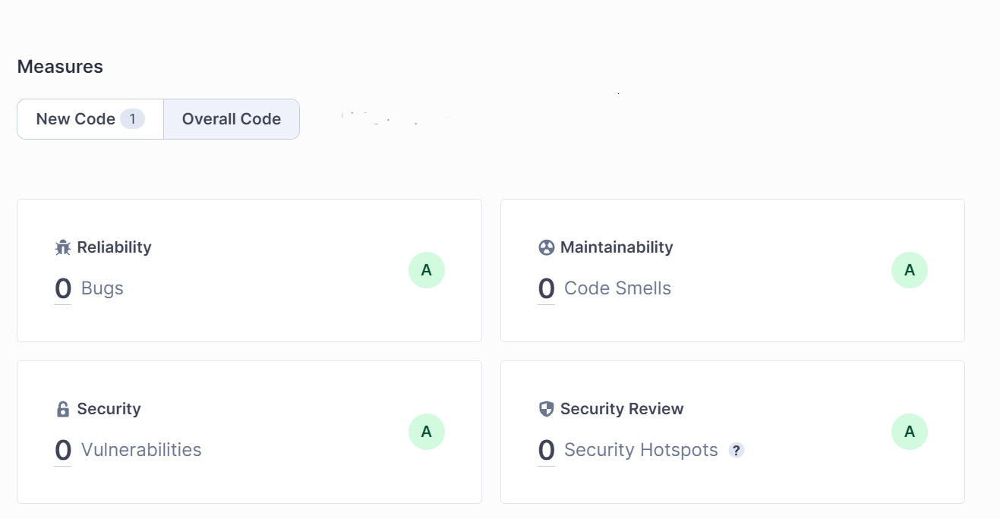

## run application

By default available at

```
http://localhost:5004/swagger/index.html
```


## sonarqube

If using a local SQ docker instance with defaults, the below can be used to analyse.



```
dotnet tool install --global dotnet-sonarscanner
dotnet tool install --global dotnet-coverage
```

To run tests and send to sq.

```
dotnet sonarscanner begin /k:"commcheck" /d:sonar.host.url="http://localhost:9000"  /d:sonar.token="ENTERTOKEN" /d:sonar.cs.vscoveragexml.reportsPaths=coverage.xml
dotnet build --no-incremental
dotnet-coverage collect "dotnet test" -f xml -o "coverage.xml"
dotnet sonarscanner end /d:sonar.token="ENTERTOKEN"

```

## Response Data

Basic Schema

```
{
  "resultId": "",
  "request": {
  },
    "response": {
  },
  "item": {
   
  },
  "rulesFileHash": "",
  "ruleOutcomes":
  {
   "summaries":[]
  }
}
```

### Result Id

Unique Id for the provided request. Generated based on a hash of the request.

### Request

The provided request for this response

### Response

The response from the outcome of the rules based on the given request.

### Item

The data item that the rules are run against. All data used for the decision is here.

### Rules File Hash

Hash of the rules file used to process the response.

### Summaries 

The results of each rule execution. 

### Example Response Data

#### Request

```
{
  "dateOfBirth": "2019-11-20",
  "dateOfSmsMostRecentUpdate": "2021-11-20",
  "dateOfEmailMostRecentUpdate": "2020-11-20",
  "dateOfAppMostRecentUpdate": "2020-11-20",
  "dateOfPostalMostRecentUpdate": "2022-11-20",
  "dateOfReasonForRemovalMostRecentUpdate": "2020-11-20",
  "deathStatusValue": "None",
  "rfR": "None"
}
```

#### Response

```
{
  "resultId": "77ad27f366719ea3a57e7e5940ddc24317687f68c9ee2a4351711efccd0f7fbe",
  "request": {
    "dateOfBirth": "2019-11-20",
    "dateOfSmsMostRecentUpdate": "2021-11-20",
    "dateOfEmailMostRecentUpdate": "2020-11-20",
    "dateOfAppMostRecentUpdate": "2020-11-20",
    "dateOfPostalMostRecentUpdate": "2022-11-20",
    "dateOfReasonForRemovalMostRecentUpdate": "2020-11-20",
    "deathStatusValue": "None",
    "rfR": "None"
  },
  "response": {
    "relativeDate": "2023-11-21",
    "startedAt": "2023-11-21T06:52:35.6695903Z",
    "updatedAt": "2023-11-21T06:52:35.7431474Z",
    "updatedCount": 4,
    "app": "Blocked",
    "email": "Blocked",
    "sms": "Blocked",
    "postal": "Blocked",
    "appReason": "Explicit Block 70: Most recent comms update was more than a year ago",
    "emailReason": "Explicit Block 70: Most recent comms update was more than a year ago",
    "smsReason": "Explicit Block 70: Most recent comms update was more than a year ago",
    "postalReason": "Explicit Block 70: Most recent comms update was more than a year ago"
  },
  "item": {
    "utcDateCheckItemCreated": "2023-11-21",
    "dateOfBirth": "2019-11-20",
    "dateOfSmsMostRecentUpdate": "2021-11-20",
    "dateOfEmailMostRecentUpdate": "2020-11-20",
    "dateOfAppMostRecentUpdate": "2020-11-20",
    "dateOfPostalMostRecentUpdate": "2022-11-20",
    "dateOfReasonForRemovalMostRecentUpdate": "2020-11-20",
    "reasonForRemoval": {
      "$type": "NoReasonForRemoval",
      "code": "",
      "notSet": true,
      "hasCode": false,
      "isEmpty": true
    },
    "deathStatus": {
      "$type": "NoDeathStatus",
      "deathCode": 0,
      "deathStatusDescription": "None"
    },
    "copyOfSource": {
      "dateOfBirth": "2019-11-20",
      "dateOfSmsMostRecentUpdate": "2021-11-20",
      "dateOfEmailMostRecentUpdate": "2020-11-20",
      "dateOfAppMostRecentUpdate": "2020-11-20",
      "dateOfPostalMostRecentUpdate": "2022-11-20",
      "dateOfReasonForRemovalMostRecentUpdate": "2020-11-20",
      "deathStatusValue": "None",
      "rfR": "None"
    },
    "daysOld": 1462,
    "daySinceSmsUpdate": 731,
    "dateOfMostRecentCommsUpdate": "2022-11-20",
    "dateOfOldestCommsUpdate": "2020-11-20",
    "yearsOld": 4,
    "daysSinceMostRecentCommsUpdate": 366,
    "daysSinceOldestCommsUpdate": 1096
  },
  "rulesFileHash": "726fc033c6aaf244d682b32baa97892c1980820f395602395eb4d17b128c5a16",
  "ruleOutcomes": {
    "summaries": [
      {
        "ruleSet": "ExplicitBlock",
        "method": "All",
        "methodToLog": "Postal",
        "enabled": true,
        "success": false,
        "ruleName": "Block all DEA.",
        "ruleExpression": "item.ReasonForRemoval.Code == \"DEA\"",
        "successEvent": "Explicit Block 10: DEA Block",
        "errorMessage": "",
        "exceptionMessage": ""
      },
      {
        "ruleSet": "ExplicitBlock",
        "method": "All",
        "methodToLog": "Postal",
        "enabled": true,
        "success": false,
        "ruleName": "Block all LogicalDeletion.",
        "ruleExpression": "Is(item.ReasonForRemoval, \"CommsCheck.LogicalDeletion\")",
        "successEvent": "Explicit Block 20: LogincalDeletion LDN Block",
        "errorMessage": "",
        "exceptionMessage": ""
      },
      {
        "ruleSet": "ExplicitBlock",
        "method": "All",
        "methodToLog": "Postal",
        "enabled": true,
        "success": false,
        "ruleName": "Block all Other.",
        "ruleExpression": "Is(item.ReasonForRemoval, \"CommsCheck.Other\")",
        "successEvent": "Explicit Block 30: Other Block",
        "errorMessage": "",
        "exceptionMessage": ""
      },
      {
        "ruleSet": "ExplicitBlock",
        "method": "All",
        "methodToLog": "Postal",
        "enabled": true,
        "success": false,
        "ruleName": "Block all Cancellation.",
        "ruleExpression": "Is(item.ReasonForRemoval, \"CommsCheck.Cancellation\")",
        "successEvent": "Explicit Block 40: Cancellation Block",
        "errorMessage": "",
        "exceptionMessage": ""
      },
      {
        "ruleSet": "ExplicitBlock",
        "method": "All",
        "methodToLog": "Postal",
        "enabled": true,
        "success": false,
        "ruleName": "Block all X.",
        "ruleExpression": "Is(item.ReasonForRemoval, \"CommsCheck.X\")",
        "successEvent": "Explicit Block 40: X Block",
        "errorMessage": "",
        "exceptionMessage": ""
      },
      {
        "ruleSet": "ExplicitBlock",
        "method": "All",
        "methodToLog": "Postal",
        "enabled": true,
        "success": false,
        "ruleName": "Block informally dead",
        "ruleExpression": "Is(item.DeathStatus, \"CommsCheck.InformallyDead\")",
        "successEvent": "Explicit Block 50: Informally dead",
        "errorMessage": "",
        "exceptionMessage": ""
      },
      {
        "ruleSet": "ExplicitBlock",
        "method": "All",
        "methodToLog": "Postal",
        "enabled": true,
        "success": false,
        "ruleName": "Block formally dead",
        "ruleExpression": "Is(item.DeathStatus, \"CommsCheck.FormallyDead\")",
        "successEvent": "Explicit Block 60: Formally dead",
        "errorMessage": "",
        "exceptionMessage": ""
      },
      {
        "ruleSet": "ExplicitBlock",
        "method": "All",
        "methodToLog": "Postal",
        "enabled": true,
        "success": true,
        "ruleName": "Block most recent more than a year",
        "ruleExpression": "item.DaysSinceMostRecentCommsUpdate > 365",
        "successEvent": "Explicit Block 70: Most recent comms update was more than a year ago",
        "errorMessage": "",
        "exceptionMessage": ""
      },
      {
        "ruleSet": "ExplicitBlock",
        "method": "All",
        "methodToLog": "Postal",
        "enabled": true,
        "success": false,
        "ruleName": "Block most old comms update more than 10 years",
        "ruleExpression": "item.DaysSinceOldestCommsUpdate > 3650",
        "successEvent": "Explicit Block 90: oldest comms update was more than 10 years ago",
        "errorMessage": "",
        "exceptionMessage": ""
      },
      {
        "ruleSet": "ExplicitBlock",
        "method": "All",
        "methodToLog": "Postal",
        "enabled": true,
        "success": false,
        "ruleName": "Person not currently born",
        "ruleExpression": "item.DaysOld < 0",
        "successEvent": "Explicit Block 100: Person not currently born",
        "errorMessage": "",
        "exceptionMessage": ""
      },
      {
        "ruleSet": "ExplicitBlock",
        "method": "All",
        "methodToLog": "Postal",
        "enabled": true,
        "success": false,
        "ruleName": "Person older than 120",
        "ruleExpression": "item.YearsOld > 120",
        "successEvent": "Explicit Block 110: Person older than 120",
        "errorMessage": "",
        "exceptionMessage": ""
      },
      {
        "ruleSet": "Allow",
        "method": "Postal",
        "methodToLog": "Postal",
        "enabled": true,
        "success": true,
        "ruleName": "Allow-PostalHasNoExitCode",
        "ruleExpression": "item.ReasonForRemoval.NotSet == true",
        "successEvent": "10 Postal allowed when no RfR is set.",
        "errorMessage": "",
        "exceptionMessage": ""
      },
      {
        "ruleSet": "ExplicitBlock",
        "method": "All",
        "methodToLog": "App",
        "enabled": true,
        "success": false,
        "ruleName": "Block all DEA.",
        "ruleExpression": "item.ReasonForRemoval.Code == \"DEA\"",
        "successEvent": "Explicit Block 10: DEA Block",
        "errorMessage": "",
        "exceptionMessage": ""
      },
      {
        "ruleSet": "ExplicitBlock",
        "method": "All",
        "methodToLog": "App",
        "enabled": true,
        "success": false,
        "ruleName": "Block all LogicalDeletion.",
        "ruleExpression": "Is(item.ReasonForRemoval, \"CommsCheck.LogicalDeletion\")",
        "successEvent": "Explicit Block 20: LogincalDeletion LDN Block",
        "errorMessage": "",
        "exceptionMessage": ""
      },
      {
        "ruleSet": "ExplicitBlock",
        "method": "All",
        "methodToLog": "App",
        "enabled": true,
        "success": false,
        "ruleName": "Block all Other.",
        "ruleExpression": "Is(item.ReasonForRemoval, \"CommsCheck.Other\")",
        "successEvent": "Explicit Block 30: Other Block",
        "errorMessage": "",
        "exceptionMessage": ""
      },
      {
        "ruleSet": "ExplicitBlock",
        "method": "All",
        "methodToLog": "App",
        "enabled": true,
        "success": false,
        "ruleName": "Block all Cancellation.",
        "ruleExpression": "Is(item.ReasonForRemoval, \"CommsCheck.Cancellation\")",
        "successEvent": "Explicit Block 40: Cancellation Block",
        "errorMessage": "",
        "exceptionMessage": ""
      },
      {
        "ruleSet": "ExplicitBlock",
        "method": "All",
        "methodToLog": "App",
        "enabled": true,
        "success": false,
        "ruleName": "Block all X.",
        "ruleExpression": "Is(item.ReasonForRemoval, \"CommsCheck.X\")",
        "successEvent": "Explicit Block 40: X Block",
        "errorMessage": "",
        "exceptionMessage": ""
      },
      {
        "ruleSet": "ExplicitBlock",
        "method": "All",
        "methodToLog": "App",
        "enabled": true,
        "success": false,
        "ruleName": "Block informally dead",
        "ruleExpression": "Is(item.DeathStatus, \"CommsCheck.InformallyDead\")",
        "successEvent": "Explicit Block 50: Informally dead",
        "errorMessage": "",
        "exceptionMessage": ""
      },
      {
        "ruleSet": "ExplicitBlock",
        "method": "All",
        "methodToLog": "App",
        "enabled": true,
        "success": false,
        "ruleName": "Block formally dead",
        "ruleExpression": "Is(item.DeathStatus, \"CommsCheck.FormallyDead\")",
        "successEvent": "Explicit Block 60: Formally dead",
        "errorMessage": "",
        "exceptionMessage": ""
      },
      {
        "ruleSet": "ExplicitBlock",
        "method": "All",
        "methodToLog": "App",
        "enabled": true,
        "success": true,
        "ruleName": "Block most recent more than a year",
        "ruleExpression": "item.DaysSinceMostRecentCommsUpdate > 365",
        "successEvent": "Explicit Block 70: Most recent comms update was more than a year ago",
        "errorMessage": "",
        "exceptionMessage": ""
      },
      {
        "ruleSet": "ExplicitBlock",
        "method": "All",
        "methodToLog": "App",
        "enabled": true,
        "success": false,
        "ruleName": "Block most old comms update more than 10 years",
        "ruleExpression": "item.DaysSinceOldestCommsUpdate > 3650",
        "successEvent": "Explicit Block 90: oldest comms update was more than 10 years ago",
        "errorMessage": "",
        "exceptionMessage": ""
      },
      {
        "ruleSet": "ExplicitBlock",
        "method": "All",
        "methodToLog": "App",
        "enabled": true,
        "success": false,
        "ruleName": "Person not currently born",
        "ruleExpression": "item.DaysOld < 0",
        "successEvent": "Explicit Block 100: Person not currently born",
        "errorMessage": "",
        "exceptionMessage": ""
      },
      {
        "ruleSet": "ExplicitBlock",
        "method": "All",
        "methodToLog": "App",
        "enabled": true,
        "success": false,
        "ruleName": "Person older than 120",
        "ruleExpression": "item.YearsOld > 120",
        "successEvent": "Explicit Block 110: Person older than 120",
        "errorMessage": "",
        "exceptionMessage": ""
      },
      {
        "ruleSet": "Allow",
        "method": "App",
        "methodToLog": "App",
        "enabled": true,
        "success": true,
        "ruleName": "AllowApp-HasNoExitCode",
        "ruleExpression": "item.ReasonForRemoval.NotSet == true",
        "successEvent": "10 App allowed when no RfR is set.",
        "errorMessage": "",
        "exceptionMessage": ""
      },
      {
        "ruleSet": "ExplicitBlock",
        "method": "All",
        "methodToLog": "Sms",
        "enabled": true,
        "success": false,
        "ruleName": "Block all DEA.",
        "ruleExpression": "item.ReasonForRemoval.Code == \"DEA\"",
        "successEvent": "Explicit Block 10: DEA Block",
        "errorMessage": "",
        "exceptionMessage": ""
      },
      {
        "ruleSet": "ExplicitBlock",
        "method": "All",
        "methodToLog": "Sms",
        "enabled": true,
        "success": false,
        "ruleName": "Block all LogicalDeletion.",
        "ruleExpression": "Is(item.ReasonForRemoval, \"CommsCheck.LogicalDeletion\")",
        "successEvent": "Explicit Block 20: LogincalDeletion LDN Block",
        "errorMessage": "",
        "exceptionMessage": ""
      },
      {
        "ruleSet": "ExplicitBlock",
        "method": "All",
        "methodToLog": "Sms",
        "enabled": true,
        "success": false,
        "ruleName": "Block all Other.",
        "ruleExpression": "Is(item.ReasonForRemoval, \"CommsCheck.Other\")",
        "successEvent": "Explicit Block 30: Other Block",
        "errorMessage": "",
        "exceptionMessage": ""
      },
      {
        "ruleSet": "ExplicitBlock",
        "method": "All",
        "methodToLog": "Sms",
        "enabled": true,
        "success": false,
        "ruleName": "Block all Cancellation.",
        "ruleExpression": "Is(item.ReasonForRemoval, \"CommsCheck.Cancellation\")",
        "successEvent": "Explicit Block 40: Cancellation Block",
        "errorMessage": "",
        "exceptionMessage": ""
      },
      {
        "ruleSet": "ExplicitBlock",
        "method": "All",
        "methodToLog": "Sms",
        "enabled": true,
        "success": false,
        "ruleName": "Block all X.",
        "ruleExpression": "Is(item.ReasonForRemoval, \"CommsCheck.X\")",
        "successEvent": "Explicit Block 40: X Block",
        "errorMessage": "",
        "exceptionMessage": ""
      },
      {
        "ruleSet": "ExplicitBlock",
        "method": "All",
        "methodToLog": "Sms",
        "enabled": true,
        "success": false,
        "ruleName": "Block informally dead",
        "ruleExpression": "Is(item.DeathStatus, \"CommsCheck.InformallyDead\")",
        "successEvent": "Explicit Block 50: Informally dead",
        "errorMessage": "",
        "exceptionMessage": ""
      },
      {
        "ruleSet": "ExplicitBlock",
        "method": "All",
        "methodToLog": "Sms",
        "enabled": true,
        "success": false,
        "ruleName": "Block formally dead",
        "ruleExpression": "Is(item.DeathStatus, \"CommsCheck.FormallyDead\")",
        "successEvent": "Explicit Block 60: Formally dead",
        "errorMessage": "",
        "exceptionMessage": ""
      },
      {
        "ruleSet": "ExplicitBlock",
        "method": "All",
        "methodToLog": "Sms",
        "enabled": true,
        "success": true,
        "ruleName": "Block most recent more than a year",
        "ruleExpression": "item.DaysSinceMostRecentCommsUpdate > 365",
        "successEvent": "Explicit Block 70: Most recent comms update was more than a year ago",
        "errorMessage": "",
        "exceptionMessage": ""
      },
      {
        "ruleSet": "ExplicitBlock",
        "method": "All",
        "methodToLog": "Sms",
        "enabled": true,
        "success": false,
        "ruleName": "Block most old comms update more than 10 years",
        "ruleExpression": "item.DaysSinceOldestCommsUpdate > 3650",
        "successEvent": "Explicit Block 90: oldest comms update was more than 10 years ago",
        "errorMessage": "",
        "exceptionMessage": ""
      },
      {
        "ruleSet": "ExplicitBlock",
        "method": "All",
        "methodToLog": "Sms",
        "enabled": true,
        "success": false,
        "ruleName": "Person not currently born",
        "ruleExpression": "item.DaysOld < 0",
        "successEvent": "Explicit Block 100: Person not currently born",
        "errorMessage": "",
        "exceptionMessage": ""
      },
      {
        "ruleSet": "ExplicitBlock",
        "method": "All",
        "methodToLog": "Sms",
        "enabled": true,
        "success": false,
        "ruleName": "Person older than 120",
        "ruleExpression": "item.YearsOld > 120",
        "successEvent": "Explicit Block 110: Person older than 120",
        "errorMessage": "",
        "exceptionMessage": ""
      },
      {
        "ruleSet": "Allow",
        "method": "Sms",
        "methodToLog": "Sms",
        "enabled": true,
        "success": true,
        "ruleName": "AllowSms-HasNoExitCode",
        "ruleExpression": "item.ReasonForRemoval.NotSet == true",
        "successEvent": "10 Sms allowed when no RfR is set.",
        "errorMessage": "",
        "exceptionMessage": ""
      },
      {
        "ruleSet": "Allow",
        "method": "Sms",
        "methodToLog": "Sms",
        "enabled": true,
        "success": false,
        "ruleName": "AllowSms-WithCGA",
        "ruleExpression": "item.ReasonForRemoval.Code == \"CGA\"",
        "successEvent": "20 Sms allowed to be sent even when CGA RfR is set",
        "errorMessage": "",
        "exceptionMessage": ""
      },
      {
        "ruleSet": "ExplicitBlock",
        "method": "All",
        "methodToLog": "Email",
        "enabled": true,
        "success": false,
        "ruleName": "Block all DEA.",
        "ruleExpression": "item.ReasonForRemoval.Code == \"DEA\"",
        "successEvent": "Explicit Block 10: DEA Block",
        "errorMessage": "",
        "exceptionMessage": ""
      },
      {
        "ruleSet": "ExplicitBlock",
        "method": "All",
        "methodToLog": "Email",
        "enabled": true,
        "success": false,
        "ruleName": "Block all LogicalDeletion.",
        "ruleExpression": "Is(item.ReasonForRemoval, \"CommsCheck.LogicalDeletion\")",
        "successEvent": "Explicit Block 20: LogincalDeletion LDN Block",
        "errorMessage": "",
        "exceptionMessage": ""
      },
      {
        "ruleSet": "ExplicitBlock",
        "method": "All",
        "methodToLog": "Email",
        "enabled": true,
        "success": false,
        "ruleName": "Block all Other.",
        "ruleExpression": "Is(item.ReasonForRemoval, \"CommsCheck.Other\")",
        "successEvent": "Explicit Block 30: Other Block",
        "errorMessage": "",
        "exceptionMessage": ""
      },
      {
        "ruleSet": "ExplicitBlock",
        "method": "All",
        "methodToLog": "Email",
        "enabled": true,
        "success": false,
        "ruleName": "Block all Cancellation.",
        "ruleExpression": "Is(item.ReasonForRemoval, \"CommsCheck.Cancellation\")",
        "successEvent": "Explicit Block 40: Cancellation Block",
        "errorMessage": "",
        "exceptionMessage": ""
      },
      {
        "ruleSet": "ExplicitBlock",
        "method": "All",
        "methodToLog": "Email",
        "enabled": true,
        "success": false,
        "ruleName": "Block all X.",
        "ruleExpression": "Is(item.ReasonForRemoval, \"CommsCheck.X\")",
        "successEvent": "Explicit Block 40: X Block",
        "errorMessage": "",
        "exceptionMessage": ""
      },
      {
        "ruleSet": "ExplicitBlock",
        "method": "All",
        "methodToLog": "Email",
        "enabled": true,
        "success": false,
        "ruleName": "Block informally dead",
        "ruleExpression": "Is(item.DeathStatus, \"CommsCheck.InformallyDead\")",
        "successEvent": "Explicit Block 50: Informally dead",
        "errorMessage": "",
        "exceptionMessage": ""
      },
      {
        "ruleSet": "ExplicitBlock",
        "method": "All",
        "methodToLog": "Email",
        "enabled": true,
        "success": false,
        "ruleName": "Block formally dead",
        "ruleExpression": "Is(item.DeathStatus, \"CommsCheck.FormallyDead\")",
        "successEvent": "Explicit Block 60: Formally dead",
        "errorMessage": "",
        "exceptionMessage": ""
      },
      {
        "ruleSet": "ExplicitBlock",
        "method": "All",
        "methodToLog": "Email",
        "enabled": true,
        "success": true,
        "ruleName": "Block most recent more than a year",
        "ruleExpression": "item.DaysSinceMostRecentCommsUpdate > 365",
        "successEvent": "Explicit Block 70: Most recent comms update was more than a year ago",
        "errorMessage": "",
        "exceptionMessage": ""
      },
      {
        "ruleSet": "ExplicitBlock",
        "method": "All",
        "methodToLog": "Email",
        "enabled": true,
        "success": false,
        "ruleName": "Block most old comms update more than 10 years",
        "ruleExpression": "item.DaysSinceOldestCommsUpdate > 3650",
        "successEvent": "Explicit Block 90: oldest comms update was more than 10 years ago",
        "errorMessage": "",
        "exceptionMessage": ""
      },
      {
        "ruleSet": "ExplicitBlock",
        "method": "All",
        "methodToLog": "Email",
        "enabled": true,
        "success": false,
        "ruleName": "Person not currently born",
        "ruleExpression": "item.DaysOld < 0",
        "successEvent": "Explicit Block 100: Person not currently born",
        "errorMessage": "",
        "exceptionMessage": ""
      },
      {
        "ruleSet": "ExplicitBlock",
        "method": "All",
        "methodToLog": "Email",
        "enabled": true,
        "success": false,
        "ruleName": "Person older than 120",
        "ruleExpression": "item.YearsOld > 120",
        "successEvent": "Explicit Block 110: Person older than 120",
        "errorMessage": "",
        "exceptionMessage": ""
      },
      {
        "ruleSet": "Allow",
        "method": "Email",
        "methodToLog": "Email",
        "enabled": true,
        "success": true,
        "ruleName": "AllowEmail-HasNoExitCode",
        "ruleExpression": "item.ReasonForRemoval.NotSet == true",
        "successEvent": "10 Email allowed when no RfR is set.",
        "errorMessage": "",
        "exceptionMessage": ""
      }
    ]
  }
}
```

## Stream data

Stream all responses that are being submitted

```
curl http://localhost:5004/check/results/stream
```

Will show real time live data.

## Dotnet benchmark

Run with

```
dotnet run -c Release "--benchmark"
```

Example below shows approx 1ms for processing a record and reading it out.

| Method       | LoopCount | Mean         | Error      | StdDev    | Median        | MeanPerLoop | Gen0       | Gen1      | Allocated   |
|------------- |---------- |-------------:|-----------:|----------:|--------------:|------------ |-----------:|----------:|------------:|
| RunBenchmark | 1         |     1.144 ms |  29.563 ms |  1.620 ms |     0.2773 ms | 1.14ms      |          - |         - |     7.47 KB |
| RunBenchmark | 10        |    31.255 ms |  48.516 ms |  2.659 ms |    31.8307 ms | 3.13ms      |          - |         - |  5786.97 KB |
| RunBenchmark | 100       |   375.774 ms | 142.078 ms |  7.788 ms |   373.8246 ms | 3.76ms      |  2000.0000 |         - | 68434.56 KB |
| RunBenchmark | 1000      | 1,862.572 ms | 721.176 ms | 39.530 ms | 1,872.2948 ms | 1.86ms      | 22000.0000 | 7000.0000 | 653149.8 KB |

## Docker

Docker files are there for the api.

## Quick run

Builds and ups

```
./run.sh
```

### Build 

```
cd src
docker buildx build -t commcheckapi .
```

### Run

```
docker compose up
```


## Check 1 - DEA Set

- DEA is set, so all should be blocked.


Try out the api, POST /check

```
{
  "dateOfBirth": "2023-11-10",
  "dateOfSmsUpdate": "2023-11-10",
  "rfR": "DEA"
}
```

This shoud give a location of 

``` 
http://localhost:5004/check/result/b8bb8f3188fc20cd8972c0ff2a8b855bdf08e4f6d5fc09af537102951f45cd76
```

which should show

```
{
  "resultId": "b8bb8f3188fc20cd8972c0ff2a8b855bdf08e4f6d5fc09af537102951f45cd76",
  "requestString": "CommsCheckItem { DateOfBirth = 11/10/2023, DateOfSmsUpdated = 11/10/2023, ReasonForRemoval = Death { Code = DEA }, DaysOld = 0, DaySinceSmsUpdate = 0, YearsOld = 0 }",
  "app": "Blocked",
  "email": "Blocked",
  "sms": "Blocked",
  "postal": "Blocked",
  "appReason": "Explicit Block 10: DEA Block",
  "emailReason": "Explicit Block 10: DEA Block",
  "smsReason": "Explicit Block 10: DEA Block",
  "postalReason": "Explicit Block 10: DEA Block"
}
```

## Check 2 - No Reason for Removal Set

- No exit code, so all allowed.

try /check api again with 

```
{
  "dateOfBirth": "2023-11-10",
  "dateOfSmsUpdate": "2023-11-10"
}
```

This should give location of

```
http://localhost:5004/check/result/3e79b07ec8d3e7adeb68b235e4776f25387c13876a24c9fad4efa2c8ce38ff7b 
```

Which should give data of:

```
{
  "resultId": "3e79b07ec8d3e7adeb68b235e4776f25387c13876a24c9fad4efa2c8ce38ff7b",
  "requestString": "CommsCheckItem { DateOfBirth = 11/10/2023, DateOfSmsUpdated = 11/10/2023, ReasonForRemoval = NoReasonForRemoval { Code =  }, DaysOld = 0, DaySinceSmsUpdate = 0, YearsOld = 0 }",
  "app": "Allowed",
  "email": "Allowed",
  "sms": "Allowed",
  "postal": "Allowed",
  "appReason": "10 App allowed when no RfR is set.",
  "emailReason": "10 Email allowed when no RfR is set.",
  "smsReason": "10 Sms allowed when no RfR is set.",
  "postalReason": "10 Postal allowed when no RfR is set."
}
```

## Check 3 - CGA Reason for Removal set

Trying a check with a status of CGA. For this, an example rule has been created:

- Allowing send to SMS when CGA code is set.

```
{
  "dateOfBirth": "2023-11-10",
  "dateOfSmsUpdate": "2023-11-10",
  "rfR": "CGA"
}
```

gives location of

```
http://localhost:5004/check/result/2b479a85444d04f525f6fb32d5349108ee31ddff77ac5af8da004a8935e75430
```

which should show results of

```
{
  "resultId": "2b479a85444d04f525f6fb32d5349108ee31ddff77ac5af8da004a8935e75430",
  "requestString": "CommsCheckItem { DateOfBirth = 11/10/2023, DateOfSmsUpdated = 11/10/2023, ReasonForRemoval = MovedAway { Code = CGA }, DaysOld = 0, DaySinceSmsUpdate = 0, YearsOld = 0 }",
  "app": "Blocked",
  "email": "Blocked",
  "sms": "Allowed",
  "postal": "Blocked",
  "appReason": "Default Block",
  "emailReason": "Default Block",
  "smsReason": "20 Sms allowed to be sent even when CGA RfR is set",
  "postalReason": "Default Block"
}
```

# View rules

Going to:

```
http://localhost:5004/rules
```

this shows all currently active rules. The pattern for decision is:

1. If any ExpiicitBlock-All rules succeed, this will BLOCK all comminucation.

1. If an ExplicitBlock for the given comms type succeeds, this will BLOCK this commm type.

1. If an Allow for the given comms type succeeds, this will ALLOW this comms type.

1. If no rules success (block or allows), then by default if will BLOCK that communication type.

Example rules are

```
[
  {
    "WorkflowName": "ExplicitBlock-All",
    "Rules": [
      {
        "RuleName": "Block all DEA.",
        "SuccessEvent": "Explicit Block 10: DEA Block",
        "ErrorMessage": "",
        "Enabled": true,
        "Expression": "input1.ReasonForRemoval.Code == \"DEA\""
      }
    ]
  },
  {
    "WorkflowName": "ExplicitBlock-App",
    "Rules": [
      {
        "RuleName": "Block all App ",
        "SuccessEvent": "Explicit App Block 10: Block All App",
        "ErrorMessage": "",
        "Enabled": false,
        "Expression": "true"
      }
    ]
  },
  {
    "WorkflowName": "ExplicitBlock-Email",
    "Rules": [
      {
        "RuleName": "Block all Email ",
        "SuccessEvent": "Explicit Email Block 10: Block All Email",
        "ErrorMessage": "",
        "Enabled": false,
        "Expression": "true"
      }
    ]
  },
  {
    "WorkflowName": "ExplicitBlock-Sms",
    "Rules": [
      {
        "RuleName": "Block all SMS ",
        "SuccessEvent": "Explicit SMS Block 10: Block All Sms",
        "ErrorMessage": "",
        "Enabled": false,
        "Expression": "true"
      }
    ]
  },
  {
    "WorkflowName": "ExplicitBlock-Postal",
    "Rules": [
      {
        "RuleName": "Block all Postal ",
        "SuccessEvent": "Explicit Postal Block 10: Block All Postal",
        "ErrorMessage": "",
        "Enabled": false,
        "Expression": "true"
      }
    ]
  },
  {
    "WorkflowName": "Allow-App",
    "Rules": [
      {
        "RuleName": "AllowApp-HasNoExitCode",
        "SuccessEvent": "10 App allowed when no RfR is set.",
        "ErrorMessage": "",
        "Expression": "input1.ReasonForRemoval.NotSet == true"
      }
    ]
  },
  {
    "WorkflowName": "Allow-Email",
    "Rules": [
      {
        "RuleName": "AllowEmail-HasNoExitCode",
        "SuccessEvent": "10 Email allowed when no RfR is set.",
        "ErrorMessage": "",
        "Expression": "input1.ReasonForRemoval.NotSet == true"
      }
    ]
  },
  {
    "WorkflowName": "Allow-Sms",
    "Rules": [
      {
        "RuleName": "AllowSms-HasNoExitCode",
        "SuccessEvent": "10 Sms allowed when no RfR is set.",
        "ErrorMessage": "",
        "Expression": "input1.ReasonForRemoval.NotSet == true"
      },
      {
        "RuleName": "AllowSms-WithCGA",
        "SuccessEvent": "20 Sms allowed to be sent even when CGA RfR is set",
        "ErrorMessage": "",
        "Expression": "input1.ReasonForRemoval.Code == \"CGA\""
      }
    ]
  },
  {
    "WorkflowName": "Allow-Postal",
    "Rules": [
      {
        "RuleName": "Allow-PostalHasNoExitCode",
        "SuccessEvent": "10 Postal allowed when no RfR is set.",
        "ErrorMessage": "",
        "Expression": "input1.ReasonForRemoval.NotSet == true"
      }
    ]
  }
]
```

## Metrics

Metrics are at 

```
http://localhost:5004/metrics
```

Example useful metrics are

```
# TYPE HashWrapper_Created_Count_total counter
HashWrapper_Created_Count_total 20 1699635284408

# TYPE HashWrapper_Returned_Count_total counter
HashWrapper_Returned_Count_total 325641 1699635284408

# TYPE CheckCommsCommandHandler_Handled_Count_total counter
CheckCommsCommandHandler_Handled_Count_total 325641 1699635284408

# TYPE ProcessCheck_Count_total counter
ProcessCheck_Count_total 1 1699635284408

# TYPE ProcessCheck_Duration_Seconds histogram
ProcessCheck_Duration_Seconds_bucket{le="0"} 0 1699635284408
ProcessCheck_Duration_Seconds_bucket{le="5"} 325640 1699635284408
ProcessCheck_Duration_Seconds_bucket{le="10"} 325640 1699635284408
ProcessCheck_Duration_Seconds_bucket{le="25"} 325640 1699635284408
ProcessCheck_Duration_Seconds_bucket{le="50"} 325640 1699635284408
ProcessCheck_Duration_Seconds_bucket{le="75"} 325640 1699635284408
ProcessCheck_Duration_Seconds_bucket{le="100"} 325640 1699635284408
ProcessCheck_Duration_Seconds_bucket{le="250"} 325640 1699635284408
ProcessCheck_Duration_Seconds_bucket{le="500"} 325640 1699635284408
ProcessCheck_Duration_Seconds_bucket{le="750"} 325640 1699635284408
ProcessCheck_Duration_Seconds_bucket{le="1000"} 325640 1699635284408
ProcessCheck_Duration_Seconds_bucket{le="2500"} 325640 1699635284408
ProcessCheck_Duration_Seconds_bucket{le="5000"} 325640 1699635284408
ProcessCheck_Duration_Seconds_bucket{le="7500"} 325640 1699635284408
ProcessCheck_Duration_Seconds_bucket{le="10000"} 325640 1699635284408
ProcessCheck_Duration_Seconds_bucket{le="+Inf"} 325640 1699635284408
ProcessCheck_Duration_Seconds_sum 0.5925409000016538 1699635284408
ProcessCheck_Duration_Seconds_count 325640 1699635284408

# TYPE ProcessCheck_Active_Count gauge
ProcessCheck_Active_Count 0 1699635284408

# EOF
```

## Load testing

wrk build

```
git clone https://github.com/wg/wrk.git wrk
cd wrk
sudo make
# move the executable to somewhere in your PATH, ex:
sudo cp wrk /usr/local/bin
```

create file

```
nano post.lua
```

add to file and save

```
wrk.method = "POST"
wrk.body   = '{"dateOfBirth": "2023-11-10","dateOfSmsUpdate": "2023-11-10","rfR": "DEA"}'
wrk.headers["Content-Type"] = "application/json"

```

Run commcheck project

```
dotnet run
```


### Results

#### Local laptop - direct return

```
wrk -t12 -c400 -d30s http://localhost:5004/check/direct -s ../post.lua
```

This will allways run the test on the data and return the response in the same request.

```
Running 30s test @ http://localhost:5004/check/direct
  12 threads and 400 connections
  Thread Stats   Avg      Stdev     Max   +/- Stdev
    Latency   163.93ms   55.94ms 678.62ms   76.83%
    Req/Sec   218.34    109.42   484.00     52.84%
  73178 requests in 30.09s, 49.55MB read
Requests/sec:   2431.92
Transfer/sec:      1.65MB
```

#### Local laptop - separate processing


```
wrk -t12 -c400 -d30s http://localhost:5004/check -s ../post.lua
```

This will not reprocess if it is already been processed.

```
Running 30s test @ http://localhost:5004/check
  12 threads and 400 connections
  Thread Stats   Avg      Stdev     Max   +/- Stdev
    Latency    19.30ms    8.76ms 159.89ms   90.83%
    Req/Sec     1.76k   357.38    13.42k    95.40%
  632274 requests in 30.09s, 217.07MB read
Requests/sec:  21015.92
Transfer/sec:      7.22MB
```

### Local laptop - get results from  separate processing run

```
wrk -t12 -c400 -d30s http://localhost:5004/check/result/b8bb8f3188fc20cd8972c0ff2a8b855bdf08e4f6d5fc09af537102951f45cd76
```

This will get results from the non direct test, ie the return value of POST calls to http://localhost:5004/check

```
Running 30s test @ http://localhost:5004/check/result/b8bb8f3188fc20cd8972c0ff2a8b855bdf08e4f6d5fc09af537102951f45cd76
  12 threads and 400 connections
  Thread Stats   Avg      Stdev     Max   +/- Stdev
    Latency     4.73ms    1.79ms  38.26ms   83.06%
    Req/Sec     7.11k     1.07k   38.17k    83.42%
  2553808 requests in 30.10s, 1.69GB read
Requests/sec:  84855.54
Transfer/sec:     57.46MB
```
