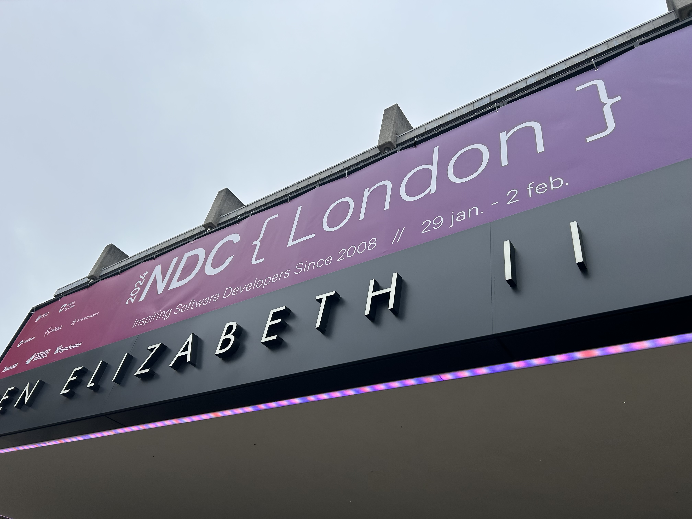
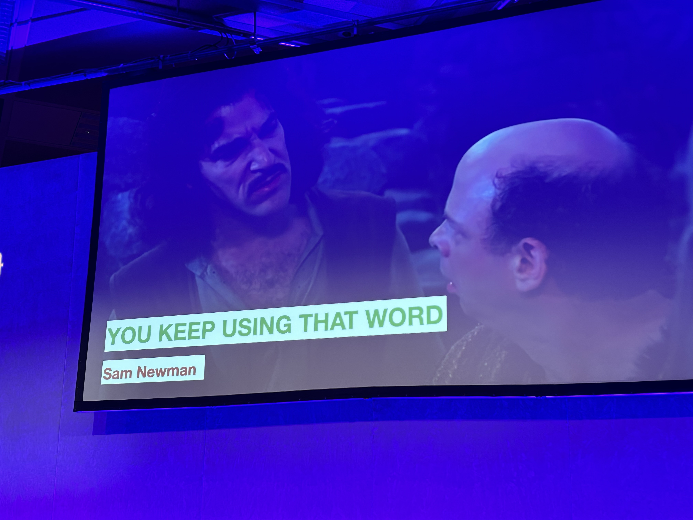

# NDC London 2024

## Wednesday, 2024-01-31

| Session Review                                                             | Title                                                                                                                                                                                       | Start | Finish | Location | Speaker                                                | Role | Org |
| -------------------------------------------------------------------------- | ------------------------------------------------------------------------------------------------------------------------------------------------------------------------------------------- | ----- | ------ | -------- | ------------------------------------------------------ | ---- | --- |
| [01](#keynote-debug-your-thinking)                                         | [Keynote: Debug your thinking](https://ndclondon.com/agenda/debug-your-thinking/b9254f6c8eed)                                                                                               | 09:00 | 10:00  | Room 1   |                                                        |      |     |
| [02](#failing-successfully)                                                | [Failing Successfully](https://ndclondon.com/agenda/failing-successfully-0vg6/0hcvcyly3c4)                                                                                                  | 10:20 | 11:20  | Room 5   |                                                        |      |     |
| [03](#you-keep-using-that-word-asynchronous-and-interprocess-comms)        | [You Keep Using That Word: Asynchronous And Interprocess Comms](https://ndclondon.com/agenda/you-keep-using-that-word-asynchronous-and-interprocess-comms-075y/0f8reo5nftf)                 | 11:40 | 12:40  | Room 2   | [Sam Newman](https://ndclondon.com/speakers/samnewman) |      |     |
| [04](#actionable-observability)                                            | [Actionable Observability](https://ndclondon.com/agenda/actionable-observability-0m4b/0useabey7eh)                                                                                          | 13:40 | 14:40  | Room 4   |                                                        |      |     |
| [05](#architecture-modernization-aligning-software-strategy-and-structure) | [Architecture Modernization: Aligning Software, Strategy, and Structure](https://ndclondon.com/agenda/architecture-modernization-aligning-software-strategy-and-structure-0dbk/0n8z6idpn3h) | 15:00 | 16:00  | Room 2   |                                                        |      |     |
| [06](#the-definitive-deep-dive-into-the-git-folder)                        | [The definitive deep dive into the .git folder](https://ndclondon.com/agenda/the-definitive-deep-dive-into-the-git-folder-0ple/0eug0l826i7)                                                 | 16:20 | 17:20  | Room 3   |                                                        |      |     |
| [07](#supercharge-your-team-by-building-clarity-not-consensus)             | [Supercharge your team by building clarity, not consensus](https://ndclondon.com/agenda/supercharge-your-team-by-building-clarity-not-consensus-0p85/00zgrkrl28z)                           | 17:40 | 18:40  | Room 5   |                                                        |      |     |

## Thursday, 2024-02-01

| Session Review                                                             | Title                                                                                                                                                                                    | Start | Finish | Location | Speaker                                                         | Role                              | Org    | 
| -------------------------------------------------------------------------- | ---------------------------------------------------------------------------------------------------------------------------------------------------------------------------------------- | ----- | ------ | -------- | --------------------------------------------------------------- | --------------------------------- | ------ | 
| [08](#so-you-want-to-build-an-event-driven-system)                         | [So You Want to Build An Event Driven System?](https://ndclondon.com/agenda/so-you-want-to-build-an-event-driven-system-0ps7/0hl94atxd8i)                                                | 09:00 | 10:00  | Room 3   |                                                                 |                                   |        | 
| [09](#distribu-ready-with-the-modular-monolith)                            | [Distribu-ready with the Modular Monolith](https://ndclondon.com/agenda/distribu-ready-with-the-modular-monolith-0bk5/0tqfug96b0i)                                                       | 10:20 | 11:20  | Room 1   |                                                                 |                                   |        | 
| [10](#better-code-reviews-ftw)                                             | [Better Code Reviews FTW!](https://ndclondon.com/agenda/better-code-reviews-ftw-03b1/0qf0kcod9s2)                                                                                        | 11:40 | 12:40  | Room 3   |                                                                 |                                   |        | 
| [10](#how-to-get-a-grip-on-your-microservices-system-using-a-service-mesh) | [How to get a grip on your microservices system using a service-mesh](https://ndclondon.com/agenda/how-to-get-a-grip-on-your-microservices-system-using-a-service-mesh-0i5h/0s50c7e5x2z) | 13:40 | 14:40  | Room 4   | [Edwin van Wijk](https://ndclondon.com/speakers/edwin-van-wijk) | Principal Solution Architect      |        | 
| [11](#lets-build-the-worst-event-sourcing-system)                          | [Let's build the worst Event Sourcing system!](https://ndclondon.com/agenda/lets-build-the-worst-event-sourcing-system-0gkz/02ohcx0a2xr)                                                 | 15:00 | 16:00  | Room 4   |                                                                 |                                   |        | 
| [12](#its-time-to-rebuild-devops)                                          | [It’s time to rebuild DevOps.](https://ndclondon.com/agenda/its-time-to-rebuild-devops-0d58/09amj6rjenn)                                                                                 | 16:20 | 17:20  | Room 5   |                                                                 |                                   |        | 
| [13](#cs-fundamentals-why-ssl-and-ssh-are-secure)                          | [CS Fundamentals: Why SSL and SSH are Secure](https://ndclondon.com/agenda/cs-fundamentals-why-ssl-and-ssh-are-secure-0xzl/081dcjv71do)                                                  | 17:40 | 18:40  | Room 1   | [Jon Skeet](https://ndclondon.com/speakers/jon-skeet)           | Staff Developer Platform Engineer | Google | 
| [14](#ndc-party---conference-reception)                                    | [NDC Party - Conference reception](https://ndclondon.com/agenda/ndc-party-london/fa1d3b3a5456)                                                                                           | 18:40 | 19:30  | Expo     |                                                                 |                                   |        | 
|                                                                            |                                                                                                                                                                                          | 19:40 | 20:40  | ???      |                                                                 |                                   |        | 
|                                                                            |                                                                                                                                                                                          | 21:00 | 22:00  | ???      |                                                                 |                                   |        | 

## Friday, 2024-02-02

| Session Review                                                          | Title                                                                                                                                                                               | Start | Finish | Location | Speaker | Role | Org |
| ----------------------------------------------------------------------- | ----------------------------------------------------------------------------------------------------------------------------------------------------------------------------------- | ----- | ------ | -------- | ------- | ---- | --- |
| [17](#keynote-transformers-the-rise-of-chatgpt)                         | [Keynote: Transformers: The Rise of ChatGPT](https://ndclondon.com/agenda/transformers-the-rise-of-chatgpt-0oys/06hffeny52j)                                                        | 09:00 | 10:00  | Room 1   |         |      |     |
| [18](#software-reimagined-the-power-of-vertical-slice-architecture)     | [Software Reimagined: The Power of Vertical Slice Architecture](https://ndclondon.com/agenda/software-reimagined-the-power-of-vertical-slice-architecture-0mcv/0qaoanr3vhh)         | 10:20 | 11:20  | Room 2   |         |      |     |
| [19](#how-github-delivers-github-using-github)                          | [How GitHub delivers GitHub using GitHub](https://ndclondon.com/agenda/how-github-delivers-github-using-github/a563c01b13e2)                                                        | 11:40 | 12:40  | Room 3   |         |      |     |
| [20](#keep-your-nose-out-of-it-denying-yourself-access-to-production)   | [Keep your nose out of it. Denying yourself access to production](https://ndclondon.com/agenda/keep-your-nose-out-of-it-denying-yourself-access-to-production-0fyv/0j73xjb1wt1)     | 13:40 | 14:40  | Room 3   |         |      |     |
| [21](#co-create-creating-better-together)                               | [Co-Create: Creating Better Together](https://ndclondon.com/agenda/co-create-creating-better-together/f42660b06066)                                                                 | 15:00 | 16:00  | Room 2   |         |      |     |
| [22](#how-javascript-happened-a-short-history-of-programming-languages) | [How JavaScript Happened: A Short History of Programming Languages](https://ndclondon.com/agenda/how-javascript-happened-a-short-history-of-programming-languages-089z/0sng56p4pjg) | 16:20 | 17:20  | Room 1   |         |      |     |

## Other Options

Dylan Beattie - Thursday  Room 1 13:40 - 14:40 [Analogue Evolution, Digital Revolution: Tipping Points in Technology](https://ndclondon.com/agenda/analogue-evolution-digital-revolution-tipping-points-in-technology/0oxwlb8rr8q)

https://ndclondon.com/agenda/understand-the-next-phase-of-web-development/04mxuc19cqz

## Ratings

0, 1, 1, 2, 3, 5, 8, 13, 21, 34, 55, 89

1:xxxx - initial review
2:xxx - adjusted review 2
n: xxxx - adjusted n

## Keynote: Debug your thinking

1: 21

- Single sparkler age 😂
- building on a foundation that wasn’t designed for the scale
- sales / product selling something before it is ready / poc work
- making the right architecture choices at the start
- doing everything right from the start - worry of running out of budget 
- you think you are doing everything right, but have you considered all the variables?
- no such thing as right architecture… no perfect language.. 
- what decisions have you made?
- what was impact?
- what negatives?
- what problems trying to solve?
- long term or short term?
- how many options considered?
- assumptions on context?
- how not overly bias on my “chosen” solution?
- how do I debug my thoughts?
- critical thinking 
- debug your thinking
- the trap: working in solution mode…
- ohh i have this problem, can you fix it for me…
- this is dangerous, bias into jumping into solution mode
- we are incentivised to jump into this. We need time to understand the problem.
- we might be trying to solve the wrong problem to begin with
- we need to slow down…
- is it actually a problem 
- people often bring us “a solution” 
- we must always dig deeper to try to understand what is going on
- always keep asking “why”
- 5 whys… 🙄
- use it for framing initial analysis 
- write it down 
- writing is natures way of telling you how sloppy your thinking is 😂😂😂
- got to make your thinking concise and clear
- framing problem:
- writing down
- avoid tech terms
- no solutions!
- make it measurable 
- then ask if this is the right problem
- the elevator problem 
- change from elevator is to slow, to, the wait time is to annoying
- added mirrors 😆😆😆 people stopped complaining
- reframing a problem
- we are here to solve business problems
- we should call out if there is a solution that involves no technical involvement at all
- ask:
- is this statement even true?
- who is affected by this?
- is there solution bias?
- what happened before this problem was occurring?
- hidden influences?
- sub optimal solution to the right problem is so much better than a perfect solution to the wrong problem 
- BIAS to speed JFDI
- why sql server used so much to store json 😂
- we are techies we want to use cool stuff
- children are naturally out of the box thinkers
- convergent and divergent thinking
- other people’s suggestions might be outside of our own box
- we feel safe in our own box of thinking
- curiosity over judgement
- hmm that’s an interesting idea, can you walk me though your thinking process on it?
- get different perspectives
- cognitive bias - it’s a feature not a bug 😂
- it give swift thinking - useful at times in real life
- but don’t need that quick reaction at work
- most common biases:
- false causality…. Are those events all connected?… 
- HIPPO effect.. highest paid persons opinion 😂😂
- authority bias
- confirmation bias
- assumption… something we believe so much we don’t even question it..
- why do I actually believe this?
- how to catch your biases:
- mindfulness… building Lego is mindful
- invite a devils advocate
- their job to involve in observing and catching the bias assumptions. Assign someone to the role and rotate it
- we want your feedback - rfc. Scale it big and you don’t have to wait for everyone. !!!!!!!!!!!!!!!!
- take aways;
- slow down
- write it down
- work together and collaborate
- 
I

## Failing Successfully

1:5

CANCELLED. Instead https://ndclondon.com/agenda/real-time-connected-apps-with-net-maui-blazor-and-signalr/0179973be3cc

- ms employee
- signal r - started with basic example
- Maui
- evolution of xamarin forms
- wrapper on iOS and andoird Mac and windows apis
- blazor. Run it all in c#
- forget needing to know js..
- blazor united - new in 8 - hybrid of server and web assembly. !!!!!!
- maui and blazor…:
- = blazor hybrid. 
- dotnetpodcasts.com - a cool example app. Is on GitHub.

## You Keep Using That Word: Asynchronous And Interprocess Comms

1: 13

- boxes and arrows 😂
- meaning of words
- this talk is not about the boxes, but about the arrows
- microservice architecture 😂
- arrow =>dependancy
- some sort of logical dependancy
- EDA - it’s all about facts. Something has happened.
- an inversion to o request response model. There is the dependancy but it’s implemented the other way round
- don’t get stuck in the con game (v3)
- use term eventual convergence instead of eventual consistency 
- The reactive manifesto (2014 v2)
- problem with blocking calls - sum latency
- temporal decoupling
- intermediary between A and B eg message broker
- need to trust your broker
- stateless stateless stateless
- making requests idempotent makes retry’s safe
- SET - the word with the most meanings in the OED. 430 different meaning. RUN, will have 645 in next draft.
- derive meaning of a word from its context 
- “in the context and of this paper…..” context is important 😊
- socialtechnical systems 
- Tower of Babel old test 
- Sam Newman - building microservices, oreilly books
- 

## Actionable Observability

## Architecture Modernization: Aligning Software, Strategy, and Structure

## The definitive deep dive into the .git folder

## Supercharge your team by building clarity, not consensus

## So You Want to Build An Event Driven System?

## Distribu-ready with the Modular Monolith

## Better Code Reviews FTW!

## How to get a grip on your microservices system using a service-mesh

## Let's build the worst Event Sourcing system!

## It’s time to rebuild DevOps.

## CS Fundamentals: Why SSL and SSH are Secure

## NDC Party - Conference reception

## Keynote: Transformers: The Rise of ChatGPT

## Software Reimagined: The Power of Vertical Slice Architecture

## How GitHub delivers GitHub using GitHub

## Keep your nose out of it. Denying yourself access to production

## Co-Create: Creating Better Together

## How JavaScript Happened: A Short History of Programming Languages