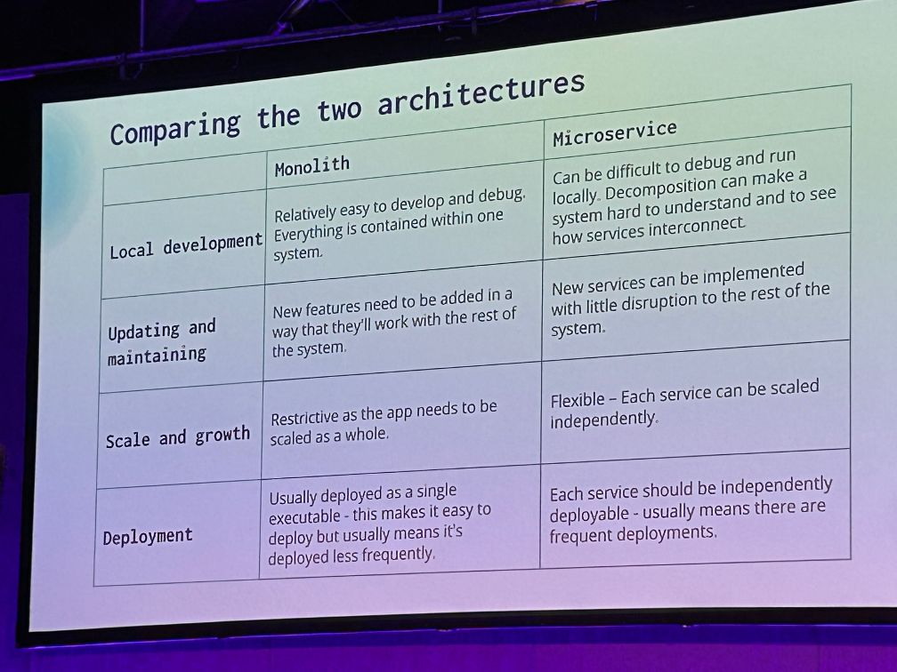

# NDC London 2024

## Wednesday, 2024-01-31

| Video | Session Review                                                                | Title                                                                                                                                                                                       | Start | Finish | Location | Speaker                                                | Role      | Org            |
| ----- | ----------------------------------------------------------------------------- | ------------------------------------------------------------------------------------------------------------------------------------------------------------------------------------------- | ----- | ------ | -------- | ------------------------------------------------------ | --------- | -------------- |
|       | [** 01](#keynote-debug-your-thinking)                                         | [Keynote: Debug your thinking](https://ndclondon.com/agenda/debug-your-thinking/b9254f6c8eed)                                                                                               | 09:00 | 10:00  | Room 1   | Laila Bougria                                          |           |                |
|       | [02](#failing-successfully)  CANCELLD                                         | [Failing Successfully](https://ndclondon.com/agenda/failing-successfully-0vg6/0hcvcyly3c4)                                                                                                  | 10:20 | 11:20  | n/a      | n/a                                                    |           |                |
|       | [** 03](#you-keep-using-that-word-asynchronous-and-interprocess-comms)        | [You Keep Using That Word: Asynchronous And Interprocess Comms](https://ndclondon.com/agenda/you-keep-using-that-word-asynchronous-and-interprocess-comms-075y/0f8reo5nftf)                 | 11:40 | 12:40  | Room 2   | [Sam Newman](https://ndclondon.com/speakers/samnewman) |           |                |
|       | [04](#actionable-observability)                                               | [Actionable Observability](https://ndclondon.com/agenda/actionable-observability-0m4b/0useabey7eh)                                                                                          | 13:40 | 14:40  | Room 6   | Lesley Cordero                                         | Tech Lead | New York Times |
|       | [** 05](#architecture-modernization-aligning-software-strategy-and-structure) | [Architecture Modernization: Aligning Software, Strategy, and Structure](https://ndclondon.com/agenda/architecture-modernization-aligning-software-strategy-and-structure-0dbk/0n8z6idpn3h) | 15:00 | 16:00  | Room 2   | Nick Tune                                              |           |                |
|       | [* 06](#the-definitive-deep-dive-into-the-git-folder)                         | [The definitive deep dive into the .git folder](https://ndclondon.com/agenda/the-definitive-deep-dive-into-the-git-folder-0ple/0eug0l826i7)                                                 | 16:20 | 17:20  | Room 3   | Rob Richardson                                         |           |                |
|       | [07](#supercharge-your-team-by-building-clarity-not-consensus)     CANCELLED  | [Supercharge your team by building clarity, not consensus](https://ndclondon.com/agenda/supercharge-your-team-by-building-clarity-not-consensus-0p85/00zgrkrl28z)                           | 17:40 | 18:40  | n/a      | n/a                                                    |           |                |

## Thursday, 2024-02-01

| Video                                                                          | Session Review                                                             | Title                                                                                                                                                                                    | Start | Finish | Location | Speaker                                                         | Role                              | Org    |
| ------------------------------------------------------------------------------ | -------------------------------------------------------------------------- | ---------------------------------------------------------------------------------------------------------------------------------------------------------------------------------------- | ----- | ------ | -------- | --------------------------------------------------------------- | --------------------------------- | ------ |
|                                                                                | [08](#so-you-want-to-build-an-event-driven-system)                         | [So You Want to Build An Event Driven System?](https://ndclondon.com/agenda/so-you-want-to-build-an-event-driven-system-0ps7/0hl94atxd8i)                                                | 09:00 | 10:00  | Room 3   | James Eastham                                                   |                                   |        |
|                                                                                | [09](#distribu-ready-with-the-modular-monolith)                            | [Distribu-ready with the Modular Monolith](https://ndclondon.com/agenda/distribu-ready-with-the-modular-monolith-0bk5/0tqfug96b0i)                                                       | 10:20 | 11:20  | Room 1   | Layla Porter                                                    |                                   |        |
| [YouTube](https://www.youtube.com/live/_T_0MNu9DGQ?si=Q_4_sFJTP3hayXXb&t=9702) | [10](#better-code-reviews-ftw)                                             | [Better Code Reviews FTW!](https://ndclondon.com/agenda/better-code-reviews-ftw-03b1/0qf0kcod9s2)                                                                                        | 11:40 | 12:40  | Room 3   | Tess Ferrandez-Norlander                                        |                                   |        |
|                                                                                | [10](#how-to-get-a-grip-on-your-microservices-system-using-a-service-mesh) | [How to get a grip on your microservices system using a service-mesh](https://ndclondon.com/agenda/how-to-get-a-grip-on-your-microservices-system-using-a-service-mesh-0i5h/0s50c7e5x2z) | 13:40 | 14:40  | Room 6   | [Edwin van Wijk](https://ndclondon.com/speakers/edwin-van-wijk) | Principal Solution Architect      |        |
|                                                                                | [11](#lets-build-the-worst-event-sourcing-system)                          | [Let's build the worst Event Sourcing system!](https://ndclondon.com/agenda/lets-build-the-worst-event-sourcing-system-0gkz/02ohcx0a2xr)                                                 | 15:00 | 16:00  | Room 6   | Oskar Dudycz                                                    |                                   |        |
|                                                                                | [12](#its-time-to-rebuild-devops)                                          | [It’s time to rebuild DevOps.](https://ndclondon.com/agenda/its-time-to-rebuild-devops-0d58/09amj6rjenn)                                                                                 | 16:20 | 17:20  | Room 5   | Paul Stack                                                      |                                   |        |
| [YouTube](https://youtu.be/wrSyPR2E8IQ?t=31563)                                | [13](#cs-fundamentals-why-ssl-and-ssh-are-secure)                          | [CS Fundamentals: Why SSL and SSH are Secure](https://ndclondon.com/agenda/cs-fundamentals-why-ssl-and-ssh-are-secure-0xzl/081dcjv71do)                                                  | 17:40 | 18:40  | Room 1   | [Jon Skeet](https://ndclondon.com/speakers/jon-skeet)           | Staff Developer Platform Engineer | Google |
|                                                                                | [14](#ndc-party---conference-reception)                                    | [NDC Party - Conference reception](https://ndclondon.com/agenda/ndc-party-london/fa1d3b3a5456)                                                                                           | 18:40 | 19:30  | Expo     |                                                                 |                                   |        |
|                                                                                |                                                                            |                                                                                                                                                                                          | 19:40 | 20:40  | ???      |                                                                 |                                   |        |
|                                                                                |                                                                            |                                                                                                                                                                                          | 21:00 | 22:00  | ???      |                                                                 |                                   |        |

## Friday, 2024-02-02

| Video | Session Review                                                          | Title                                                                                                                                                                               | Start | Finish | Location | Speaker            | Role | Org |
| ----- | ----------------------------------------------------------------------- | ----------------------------------------------------------------------------------------------------------------------------------------------------------------------------------- | ----- | ------ | -------- | ------------------ | ---- | --- |
|       | [17](#keynote-transformers-the-rise-of-chatgpt)                         | [Keynote: Transformers: The Rise of ChatGPT](https://ndclondon.com/agenda/transformers-the-rise-of-chatgpt-0oys/06hffeny52j)                                                        | 09:00 | 10:00  | Room 1   | Kesha Williams     |      |     |
|       | [18](#software-reimagined-the-power-of-vertical-slice-architecture)     | [Software Reimagined: The Power of Vertical Slice Architecture](https://ndclondon.com/agenda/software-reimagined-the-power-of-vertical-slice-architecture-0mcv/0qaoanr3vhh)         | 10:20 | 11:20  | n/a      | cancelled          |      |     |
|       | [19](#how-github-delivers-github-using-github)                          | [How GitHub delivers GitHub using GitHub](https://ndclondon.com/agenda/how-github-delivers-github-using-github/a563c01b13e2)                                                        | 11:40 | 12:40  | Room 3   | April Edwards      |      |     |
|       | [20](#keep-your-nose-out-of-it-denying-yourself-access-to-production)   | [Keep your nose out of it. Denying yourself access to production](https://ndclondon.com/agenda/keep-your-nose-out-of-it-denying-yourself-access-to-production-0fyv/0j73xjb1wt1)     | 13:40 | 14:40  | Room 3   | Glenn F. Henriksen |      |     |
|       | [21](#co-create-creating-better-together)                               | [Co-Create: Creating Better Together](https://ndclondon.com/agenda/co-create-creating-better-together/f42660b06066)                                                                 | 15:00 | 16:00  | Room 2   | Denise Jacobs      |      |     |
|       | [22](#how-javascript-happened-a-short-history-of-programming-languages) | [How JavaScript Happened: A Short History of Programming Languages](https://ndclondon.com/agenda/how-javascript-happened-a-short-history-of-programming-languages-089z/0sng56p4pjg) | 16:20 | 17:20  | Room 1   |                    |      |     |

## YouTube Stream Urls

| Day    | Room   | Stream                                      |
| ------ | ------ | ------------------------------------------- |
| Wed    | Room 1 | https://www.youtube.com/watch?v=YIi3zMR4JSQ |
| Thurs  | Room 1 | https://www.youtube.com/watch?v=wrSyPR2E8IQ |
| Friday | Room 1 | https://www.youtube.com/watch?v=COcZcGnPfxs |
| Wed    | Room 2 | https://www.youtube.com/watch?v=p0ylCTjZDLc |
| Thurs  | Room 2 | https://www.youtube.com/watch?v=HTwK7pPhRH4 |
| Friday | Room 2 | https://www.youtube.com/watch?v=H5SvfcZrfjY |
| Wed    | Room 3 | https://www.youtube.com/watch?v=1jlXtoOyprM |
| Thurs  | Room 3 | https://www.youtube.com/watch?v=_T_0MNu9DGQ |
| Friday | Room 3 | https://www.youtube.com/watch?v=Lq24s9I-JPA |
| Wed    | Room 5 | https://www.youtube.com/watch?v=fuDQTDBocpw |
| Thurs  | Room 5 | https://www.youtube.com/watch?v=OLXgvGmiHkE |
| Fri    | Room 5 | https://www.youtube.com/watch?v=Nzc8FACQ1_c |
| Wed    | Room 6 | https://www.youtube.com/watch?v=nywlTFOoiUM |
| Thurs  | Room 6 | https://www.youtube.com/watch?v=tRF4CJxa-yQ |
| Fri    | Room 6 | https://www.youtube.com/watch?v=ieyRch7I_cI |

## Other Options

Dylan Beattie - Thursday  Room 1 13:40 - 14:40 [Analogue Evolution, Digital Revolution: Tipping Points in Technology](https://ndclondon.com/agenda/analogue-evolution-digital-revolution-tipping-points-in-technology/0oxwlb8rr8q)

https://ndclondon.com/agenda/understand-the-next-phase-of-web-development/04mxuc19cqz

## Interested From Others 

- AlRa: 04, 11

## NDC London 2024 Review

### So what is NDC anyway?

# Session Notes

## Ratings

0, 1, 1, 2, 3, 5, 8, 13, 21, 34, 55, 89

1:xxxx - initial review
2:xxx - adjusted review 2
n: xxxx - adjusted n

## Keynote: Debug your thinking

> ### NDC Summary
> 
> There’s a myriad of complexity involved in building systems. However, two decades in software engineering taught me what truly makes or breaks a system: decisions. It’s not the programming language, the data store, the deployment model, or [insert your favorite tech here]. It’s about the decisions made and the ripple effects they cause. We spend endless hours trying to keep up with the latest and greatest in an industry that sprints faster than a caffeinated cheetah... But how much time was invested in questioning, improving, or, essentially, debugging our thinking process?
> 
> How do you structure your decisions, and how do they affect the software you build? When suboptimal decisions occur, do you reflect on the decision-making process itself? I've spent the last few years debugging my decision-making thought process, placing breakpoints to inspect which assumptions got me here and what alternatives I may have missed. As a result, my thought process became much more structured and streamlined, leading to better-balanced decisions. Join me in this session to explore how critical thinking can transform our decision-making process and elevate the quality of the solutions we build for our users.
> 
> Laila Bougria is a software engineer and solution architect with over 15 years of experience in the .NET space. She's a Microsoft Azure MVP and frequent speaker at conferences around the world. Currently, Laila is busy building NServiceBus at Particular Software and solving distributed riddles. When she's not immersed in code, Laila enjoys indulging in her favorite pastime - knitting! She finds that tangling the yarn into beautiful patterns helps untangle her thoughts.

### My Notes

1: 21

- Single sparkler age 😂
- building on a foundation that wasn’t designed for the scale
- sales / product selling something before it is ready / poc work
- making the right architecture choices at the start
- doing everything right from the start - worry of running out of budget 
- you think you are doing everything right, but have you considered all the variables?
- no such thing as right architecture… no perfect language.. 
- what decisions have you made?
- what was impact?
- what negatives?
- what problems trying to solve?
- long term or short term?
- how many options considered?
- assumptions on context?
- how not overly bias on my “chosen” solution?
- how do I debug my thoughts?
- critical thinking 
- debug your thinking
- the trap: working in solution mode…
- ohh i have this problem, can you fix it for me…
- this is dangerous, bias into jumping into solution mode
- we are incentivised to jump into this. We need time to understand the problem.
- we might be trying to solve the wrong problem to begin with
- we need to slow down…
- is it actually a problem 
- people often bring us “a solution”
- we must always dig deeper to try to understand what is going on
- always keep asking “why”
- 5 whys… 🙄
- use it for framing initial analysis 
- write it down 
- writing is natures way of telling you how sloppy your thinking is 😂😂😂
- got to make your thinking concise and clear
- framing problem:
- writing down
- avoid tech terms
- no solutions!
- make it measurable 
- then ask if this is the right problem
- the elevator problem 
- change from elevator is to slow, to, the wait time is to annoying
- added mirrors 😆😆😆 people stopped complaining
- reframing a problem
- we are here to solve business problems
- we should call out if there is a solution that involves no technical involvement at all
- ask:
- is this statement even true?
- who is affected by this?
- is there solution bias?
- what happened before this problem was occurring?
- hidden influences?
- sub optimal solution to the right problem is so much better than a perfect solution to the wrong problem 
- BIAS to speed JFDI
- why sql server used so much to store json 😂
- we are techies we want to use cool stuff
- children are naturally out of the box thinkers
- convergent and divergent thinking
- other people’s suggestions might be outside of our own box
- we feel safe in our own box of thinking
- curiosity over judgement
- hmm that’s an interesting idea, can you walk me though your thinking process on it?
- get different perspectives
- cognitive bias - it’s a feature not a bug 😂
- it give swift thinking - useful at times in real life
- but don’t need that quick reaction at work
- most common biases:
- false causality…. Are those events all connected?… 
- HIPPO effect.. highest paid persons opinion 😂😂
- authority bias
- confirmation bias
- assumption… something we believe so much we don’t even question it..
- why do I actually believe this?
- how to catch your biases:
- mindfulness… building Lego is mindful
- invite a devils advocate
- their job to involve in observing and catching the bias assumptions. Assign someone to the role and rotate it
- we want your feedback - rfc. Scale it big and you don’t have to wait for everyone. !!!!!!!!!!!!!!!!
- take aways;
- slow down
- write it down
- work together and collaborate
- 
I

## Failing Successfully

1:5

CANCELLED. Instead https://ndclondon.com/agenda/real-time-connected-apps-with-net-maui-blazor-and-signalr/0179973be3cc

- ms employee
- signal r - started with basic example
- Maui
- evolution of xamarin forms
- wrapper on iOS and andoird Mac and windows apis
- blazor. Run it all in c#
- forget needing to know js..
- blazor united - new in 8 - hybrid of server and web assembly. !!!!!!
- maui and blazor…:
- = blazor hybrid. 
- dotnetpodcasts.com - a cool example app. Is on GitHub.

## You Keep Using That Word: Asynchronous And Interprocess Comms

> ### NDC Summary
>
> You Keep Using That Word: Asynchronous And Interprocess Comms
>
> When it comes to distributed computing, one of the perennial topics comes down to how different services should communicate. Working out the relative merits of specific technical approaches can become a complex affair however, so we often reach for categorisation to simplify our work.
> 
> Sam Newman is interested in technology at the intersection of things, from development, to ops, to security, usability and organisations. After over a decade at ThoughtWorks he is now an independent consultant. Sam is the author of "Building Microservices" from O'Reilly. He has worked with a variety of companies in multiple domains around the world, often with one foot in the developer world, and another in the IT operations space. If you asked him what he does, he’d say ‘I work with people to build better software systems’. He has written articles, presented at conferences, and sporadically commits to open source projects. While Java used to be his bread and butter, he also spends time with Ruby, Python, Javascript, and Clojure, Infrastructure Automation and Cloud systems.

### My Notes
1: 13

- boxes and arrows 😂
- meaning of words
- this talk is not about the boxes, but about the arrows
- microservice architecture 😂
- arrow =>dependancy
- some sort of logical dependancy
- EDA - it’s all about facts. Something has happened.
- an inversion to o request response model. There is the dependancy but it’s implemented the other way round
- don’t get stuck in the con game (v3)
- use term eventual convergence instead of eventual consistency 
- The reactive manifesto (2014 v2)
- problem with blocking calls - sum latency
- temporal decoupling
- intermediary between A and B eg message broker
- need to trust your broker
- stateless stateless stateless
- making requests idempotent makes retry’s safe
- SET - the word with the most meanings in the OED. 430 different meaning. RUN, will have 645 in next draft.
- derive meaning of a word from its context 
- “in the context and of this paper…..” context is important 😊
- socialtechnical systems 
- Tower of Babel old test 
- Sam Newman - building microservices, oreilly books
- 

## Lunch

- does pressing lift buttons with a non body part increase chance of lift coming?
- is static from body just lighting up the button led?…

## Actionable Observability

> ### NDC Notes
>
> While observability is the first step towards building observable systems, monitoring enables us to action on the telemetry collected.
.
> Previous approaches to monitoring have relied primarily on infrastructure and service metrics, but modern approaches have embraced the idea of monitoring based on metrics that reflect the user experiences more accurately.
>
> This talk will elaborate on those differences and a new monitoring approach that actions on SLOs. We’ll cover the following:
> 1. Observability vs Monitoring
> 2. Metrics and Types of Metrics & Monitors
> 3. Why SLOs are a good monitoring strategy
> 
> Lesley Cordero is currently a Staff Software Engineer, Tech Lead at The New York Times. She has spent the majority of her career on edtech teams as an engineer, including Google for Education and other edtech startups.
>
> In her current role, she is focused on observability, shared platforms, and building excellent teams by setting reliability vision & strategy across The Times, improving our observability footprint, and cultivating culture that builds with the most vulnerable employees in mind first. She shows care for others by holding them accountable to the best versions of themselves – and by buying them the occasional bubble tea.

### My Notes
1:8

- observability: understanding what is happening inside software systems to debug a problem, from telemetry emitted by system 
- utilising telemetry with goal of improving application reliability
- identify, debug, address tech issues
- incident management cycle
- role of automation.. reduce complexity, manage cognitive load
- collect ->identify->debug->….
- automate identity otherwise sat there looking at dashboards. Be proactive.
- infra metrics, service metrics, app metrics, user experience metrics
- define user journey, define metric, define thresholds. Eg:
- message send request submitted. => time to result of send received => a threshold…
- coming up with thresholds will often be iterative
- service level objectives:
- prioritise user journeys, focus on most important
- “North Star” metrics
- don’t let SLOs become overwhelmingly huge
- Service Level Indicator - reliability is different to availability. SLI should represent reliability. Eg very high latency could be counted equivalent to offline.
- setting error budget
- reliability 0-100% score
- alerting strategy:
- consumption of budget vs rate of change of budget (burn rate)
- automation not about replacing us, it’s about enabling us

## Snack bar

 

## Architecture Modernization: Aligning Software, Strategy, and Structure

> ### NDC Notes
>
> Architecture Modernization: Aligning Software, Strategy, and Structure
> 
> Legacy architectures are a business risk, stifling your organization's ability to innovate. On the other hand, modernized architectures can be a competitive advantage allowing your business to innovate at speed and scale their organizations.
>
> Nick Tune works with product and technology leaders to map strategy, model domains, design architecture and build continuous delivery teams while helping to deliver successful business outcomes. He is the author of Architecture Modernization (Manning), and Principles and Practices of Domain-Driven Design (Wrox).

### My Notes

1:21 / 34

- nick tune- architecture modernisation - book
- ran the workshop sessions on ddd that JB attended 
- teams deploying multiple times a day
- need to see it early enough that you need to modernise
- open table stopped all features and modernised for 8 months… not always advocating that approach
- doing nothing- how long until irrelevant or fail?
- even if make good arch decisions, your assumptions your decisions are based on will change over time
- result: still end up with messy architecture…
- arch modernisation -> convert disadvantage to advantage
- talk overview:
- architecting for flow
- tools 
- kickstarting and enabling arch modernisation
- rewriting / using new tech, doesn’t fix all the problems. It’s deeper than that. It enables you to then be able to fix actual problem
- make changes / features fit inside one subdomain
- empower teams
- software decoupled
- always will have the question of should we do modernisation work or new feature work
- time to listen - indi young - book
- need the business objective to support the modernisation decisions
- impact mapping
- wardley mapping
- make decisions based on how component is evolving, not its current state
- ask how quickly each component is evolving
-  Event storming. Big picture and process modelling
- getting a true wide-perspective picture
- domains and subdomains
- grouping and transition points
- modernisation strategy selector..
- how to maximise roi on modernisation 
- platform modernisation and also,
- product, domain, software modernisation 
- codescene tool
- keeping momentum after event storming workshops
- architecture modernisation enabling team AMET. Don’t own a part of system, but help them achieve the change.
- team for range of skills not just arch’s.
- don’t get lost in all upfront planning
- make a decision on when first change will be seen. Aim a target of 3 - 6 months?
- patterns for migrations. Strangler fig. DDD bubble pattern. Danger of strangler fig.
 
## The definitive deep dive into the .git folder

> ### NDC Notes
>
> The definitive deep dive into the .git folder
> 
> What's in the .git folder? How are commits stored? How do branches work?
>
> We'll dive deep into the objects folder, unpack commits, look at the types of DAG nodes, examine object content, and build a complete visualization of the stored content. We'll also quickly look through Git hooks, Git config, and ref logs. Come experience the zen of git.
>
> Rob Richardson is a software craftsman building web properties in ASP.NET and Node, React and Vue. He’s a Microsoft MVP, published author, frequent speaker at conferences, user groups, and community events, and a diligent teacher and student of high quality software development. You can find this and other talks at https://robrich.org/presentations and follow him on twitter at @rob_rich.

### My Notes

1:13

- .git that folder is all you need
- objects - all git zlib compressed. Files created on commit. Files are named by hash of commit
- all the slides are on his GitHub 
- the commit reference another object id node
- tree node lists files and permissions 
- and is double zlib compressed
- the tree references blobs
- git cat-file
- git add puts the file in as a blob - it’s staged.
- the commit creates the commit object and links it to the blobs via tree object
- folders nested are represented by another tree node 
- git commit with -amend, this changed the file. But history is still stored.
- branches - refs folders
- git remotes can also be relative local file system paths…
- hooks folder, great for automation
- although hooks can’t be committed… so look at npm githooks which use symlinks
- Git config files - alias section

## Supercharge your team by building clarity, not consensus

CANCELLED

instead watch this:

https://ndclondon.com/agenda/ada-lovelace-and-the-very-first-computer-program-0bv2/0s6o9bizrgp

## So You Want to Build An Event Driven System?

> ### NDC Notes
>
> So You Want to Build An Event Driven System?
> 
> Making your system 'event driven' is a common consideration when building modern systems. Especially if these applications leverage serverless technologies.
> 
> But what does that actually mean in the real world? What are the benefits of adopting this architecture style, what are the challenges and some of the tradeoffs?
> 
> In this session, you'll learn all about that and more with tips taken from building event driven systems in the real world. Starting from why, understanding what and plenty of practical things you can take away and use in your own applications. From the simple, through to some advanced integration patterns that this architecture style unlocks. to improve the resilience, extensibility and scalability of your systems.

### My Notes
1:21

- yuval Noah harari- sapiens - book:
- about stories being so important
- EDA is a communication pattern
- modelling the integration
- James Eastham - aws architect
- built EDA in the past, and many have failed
- learn more from failure than success
- example is that we are devs at plant based pizza, system currently request response.
- order processing have dependency on everything, kitchen, delivery etc
- aim for high cohesion, and low coupling 
- an appropriate level of coupling depends on the level of control you have over the endpoints.
- Martin fowlers talk on eda:
- what is eda - reversing dependencies 
- what is an event.. An immutable fact. Something that has happened in the past. It cannot be changed.
- event driven system vs event based system:
- eds- it’s driven by business events eg: PizzaBoxed, DeliveryNotificationSent.
- tell the story of your business through events
- events are first class citizens: events designed even before api.: Event First Design.
- notification event. Lightweight. Anaemic. Often leads to an api call to the sender. Can lead to fire, as far to many calls back to originator. The producer of events should be unaware of downstream consumers.
- event carried state transfer - a fat event. More in there for downstream consumers can use.
-  producer, consumer and event broker (bus, queue etc) - pub sub.
- always put a queue in front of compute. Eventbus ==>>> my domain (my queue => my compute). Protect your self from overload.
- go do event storming - to understand what the business events are 
- governance for controlling events… stop the unknowns breaking.
- put out a public RFC before changing.
-  payload. Split to data and meta. Meta should contain ids, event type, version. VERSION NUMBER. Depreciated flag? Sunset dates.
- fat vs sparse. Always - it depends.
- enriched pattern
- use eventual convergence over term eventual consistency. Embracing this is the EDA trade off.
- EDA dealing with http request response. Wrap events into a way to make call, and the publish event when finished, with a queue.
- meta data to contain trace ids. Previous event that triggered it.
- boundaries. Going to need request response somewhere at the edge. Really thin synchronous wrapper that dumps onto event bus - posts.
- but for gets.. separation of command events and queries. 
- processing commands synchronously. Eg send an email. 
- where should the responsibility lay. If truely event, eg email service listening to order created. Using queue for async commands.
- load on cqrs.
- transactional outbox pattern. Storing data in service before publishing it to the service.
- change data capture - stream output, publish events from the back of it. Using dynamodb streams. publish events.
- redid cache for query.

Question: integration event bus, fire and forget, or persistent and support event replay ability?

It depends on the use case. Does it need to get there? Then if persistent horizontal client scaling is hard. Or fifo queue. Ugh.

Question: how to deal with the common question of: now everything is dependant on a single event bus. Worry?

## Distribu-ready with the Modular Monolith

> ### NDC Notes
> 
> Distribu-ready with the Modular Monolith
> 
> The past few years have seen huge hype around distributed systems and microservices.
> 
> Pre-emptive implementation of a distributed architecture has led to many engineering teams struggling with vast complexity and sadly for many, the dreaded "Distributed Monolith".
> 
> Some teams are in such a pickle that they are even reverting their distributed applications back to a monolith.
> 
> I'm all for designing and developing for future growth, but there is a better way than diving straight into distributed architecture.
> 
> Behold, the Modular Monolith.
> 
> By design, the modular monolith is "distribu-ready" and in this session, we'll cover the design principles and implementations that make the modular monolith one of the best options for future-proofing your application whilst minimising complexity.
> 
> Layla Porter is a Developer Advocate at VMware serving the .NET community. She makes videos and livecodes on YouTube. She is a Microsoft MVP, a GitHub Star, Progress Ninja, and the founder of the #WomenOfDotNet Initiative. Layla loves sharing knowledge whilst having fun. No question is stupid and beginners are always welcome.

### My Notes

1:13

https://ndclondon.com/agenda/distribu-ready-with-the-modular-monolith-0bk5/0tqfug96b0i

https://ndclondon.com/speakers/layla-porter

-  complexity is your enemy. Anyone can make something complicated. It’s hard to keep it simple.. Richard Branson
- monolith. Single executable. Some benefits. But problems. Simple deploy.
- hard to scale and maintain.
- microservice architecture. Divide into lots of small independently deployable services.
- what needs? Want to scale. What are options:
- go through code or infra and scale vertical / horizontal.
- or distributed system.
- the cost of distributed is simplicity.
- distro monolith is the worse place to be
- shared db is the evil of distro monoliths.
- DM: hard bits of complexity. But not of the independence benefits. None of the monolith ease of debug.
- DDD. Lose coupling and high cohesion.
- the more pleasant system to get there…
- the modular monolith.
- mono to modular mono (not distro mono) to microservice.
- the kitkat pattern.
- how to decompose the mono app.
- decomposing the database. Code first or db first. START db separation first. Then move onto code separation… 
- be pragmatic, not dogmatic.
- so…. The how?:
- how to ensure completely independent?
- how to communicate?:
- external not much change.
- internal inter proc comms:
- mediator pattern.
- messaging pattern.
- thin and fat content payloads
- how to enforce architecture… code review. 
- .net aspire https://learn.microsoft.com/en-us/dotnet/aspire/get-started/aspire-overview

Question: this focused on mono to micro. What happens if already in the distro mono hole?

A: pray 😂 communicate why it’s a problem. Need people to see why it’s a bad place to be.
 

## Better Code Reviews FTW!

> ### NDC Notes 
> 
> Better Code Reviews FTW!
> 
> Code reviews is feedback, but if your friend or partner or colleague would ask you for feedback on some of their work, you would probably not send them a list of 50 things they did wrong.
> 
> Yet in code reviews, this is perfectly normal.
> 
> Could we do better code reviews by just changing the way we give and take feedback? I'll share 10 tips that I try to follow to turn code reviews from a boring exercise or something you dread to a much more pleasant experience.
> 
> Tess Ferrandez-Norlander is a developer/data scientist working at Microsoft. Over the past 20 years she has changed the way we do .net debugging, developed machine learning models and Azure solutions with some of the largest companies in Europe and the US.
> 
> She has has spoken at lots and lots of conferences around the world on a wide variety of topics including deep .net debugging, UX, web development, Machine Learning and engineering processes. You can also find her on twitter at @TessFerrandez
>
>

### My Notes

1: 13

- why do code reviews? 
- finding defects least of concerns?
- it should focus on sharing knowledge and sharing patterns
- sharing knowledge
- shared ownership of code in the squad. 
- on merge it’s going from my code to our code
- how to do code reviews like a human
- be open for feedback
- appreciate what people do right, not brining down on the what they do wrong.
- award ties in discussions to the reviewer.! (The reviewer has a fresh set of eyes..) or at least consider this.
- review your own PR first
- have an absolute style guide.
- PR review should be a higher priority than anything else at all. Help someone to finishing something is better than starting something new.
- developers don’t have much patience. From a given list will pick the low hanging fruit and ignore the complex points
- regular little is the way forward. Through PR aim to get D grade code to C grade, not A grade. Next time it’s touched it can go from C to B/A. Or do a separate extra or to improve that.
- suggest code changes rather than just saying something is bad / wrong. Teach.
- framing feedback as questions
- if your arguing in code reviews, probably doing it wrong.
 

## How to get a grip on your microservices system using a service-mesh

> ### NDC Notes
> 
> How to get a grip on your microservices system using a service-mesh
> 
> Many organizations are now building microservices based systems. But with the adoption of this architecture-style, the need arises for a good way to manage and monitor all the services and their traffic. To handle this, you can leverage what is called a service-mesh.
> 
> In this session attendees will learn what a service-mesh is and how to implement one for a microservices based system using Kubernetes and Istio. Topics covered are: intelligent traffic-routing, canary releasing, testing resiliency using chaos-engineering and monitoring using several available telemetry dashboards.
> 
> Edwin van Wijk has been working in IT since 1999 and is currently working as Principal Solution Architect and Microsoft Community Lead at Info Support in The Netherlands. He is a Microsoft MVP in the Developer Technologies category (since 2016). His primary areas of expertise are: building distributed systems, systems integration, (cloud-native) software architecture and patterns, software craftsmanship, .NET (Core) development, Azure and DevOps. Edwin likes to share his experience and knowledge about these subjects by training people, publishing videos (www.youtube.com/dotnetflix) and speaking at conferences.

### My Notes

- this is heavy on k8s
- what is service mesh and why use it
- observability
- chaos engineering
- service mesh almost always use sidecar pattern
- ambient mesh coming soon, does it without another container
- sidecar runs alongside actual container, in the same pod
- istio as a mesh provider
- kiali very cool graph views ok k8s injections and traffic etc between them
- service mesh - power comes from mirroring requests to new versions of a service. Ie test a new version with real live data (obv any transactions etc have to be separate db etc)
- chaos engineering, injection faults, including network level style failures

## Let's build the worst Event Sourcing system!

> ### NDC Notes
> 
> Let's build the worst Event Sourcing system!
> 
> Everyone likes to talk about best practices. We'll go the other way round and gather all the worst practices to learn how to build the worst Event Sourcing system!
> 
> Event Sourcing is perceived as a complex pattern that’s challenging to learn. In fact, it's pretty simple, but the way it's taught may lead to such a conclusion. By going through the worst ideas, we'll also learn the essence of Event Sourcing. 
> 
> I'm a developer, technical team leader, and architect. I started a career before StackOverflow existed. For over 14 years, I've been creating systems close to the business process. I believe that Event-Driven Architectures and Event Sourcing are great ways to achieve that.
> 
> I'm an active open-source developer and one of the Marten library maintainers. I'm sharing my journey and findings on my blog https://event-driven.io and practical samples at https://github.com/oskardudycz.
> 
> I'm a developer, technical team leader, and architect. I started a career before StackOverflow existed. For over 14 years, I've been creating systems close to the business process. I believe that Event-Driven Architectures and Event Sourcing are great ways to achieve that.
> 
> I'm an active open-source developer and one of the Marten library maintainers. I'm sharing my journey and findings on my blog https://event-driven.io and practical samples at https://github.com/oskardudycz.

### My Notes

1: 21/34

- project franz 
- worst es system ever
- event store db
- Kafka for event storing or event bridge
- idempotency
- event ordering
- the queue we are standing in is always the slowest 😂
- Kafka topic and partition split. Topic is logical, partition is physical.
- event disordering 😂
- process managers. 
- the confusion between event sourcing and event streaming
- optimistic concurrency
- strong consistency
- Kafka can’t do the optimist concurrency
- basically don’t use Kafka for event sourcing.
- Kafka is good for what it should be used for.
- Kafka is for event streaming.
- event sourcing is about recording and storing business events.
- event streaming is about moving data from one place to another.
- cap theorem - consistency, availability, partitioning - can’t have all 3
- outbox pattern, store state and output message at same time. Both or neither
- CRAP theorem - managers wanting 100% of c an and p…
- passive aggressive events
- eg the bin is full, the dishwasher has finished 😂😂😂😂
- stream design. Event sourcing is still just storage.
- events on the inside and events on the outside.
- domain and integration events.
- important to have the distinction.
- keep granular events in your domain, in your domains own event store.
- long living streams. More events a stream, iops goes up
- snapshots. Every event? Some period of time? Every x events?
- hope driven design HDD
- snaps shots are a cache…
- closing the book. Eg rather than account, accounting month. Stream restarts each month.
- a bad system will beat a good person every time.
- fear uncertainty and doubt
- Peter principle
- running with an empty barrow

## It’s time to rebuild DevOps.

> ### NDC Notes
> 
> It’s time to rebuild DevOps.
> 
> It's almost 15 years since the inception of DevOps. The core value of DevOps was to break down the silos and improve communication to achieve stability, reliability, availability, and security.
> 
> In the boom of the ecosystem since that point, it sometimes feels like we've created more silos and stemmed communication in every way with the tooling we have. What if we take the lessons we’ve learned along the way and try to reimagine DevOps tooling to fulfill the original promise of the DevOps movement? What if we could remove the 200% problem (the need to know a specialist language AND a cloud framework) from our tooling? What if we could focus on delivery in a collaborative manner rather than communicating via a series of handoffs via pull requests? It’s time for a second wave of DevOps tools.
> 
> In this talk, Paul is going to reflect on the lessons we've learned along the DevOps journey, for example Infrastructure as Code, and talk about the work System Initiative is doing to revolutionize how people collaborate to build and maintain complex infrastructure. System Initiative is the beginning of an ecosystem to create a real-time, multiplayer, multi-modal reinvention of DevOps tooling. System Initiative provides a modern, state of the art approach to infrastructure management that increases productivity with its simulation-based workflow.
> 
> Once you see what it’s possible to achieve, you won’t want to settle any longer.
> 
> Paul Stack is an infrastructure coder and has spoken at various events throughout the world about his passion for continuous integration, continuous delivery and good operational procedures and why they should be part of what developers and system administrators do on a day to day basis. He believes that reliably delivering software is more important as its development. Paul’s passions are the DevOps and Continuous Delivery movements and how they help the entire business and its customers.

### My Notes

- breaking the mould
- may be a triggering talk for some 😂
- gene kim devops handbook, book
- Chris reed. Unless your pretty code is in production, you’re just wasting time.
- 2019 there were 80 devops days
- already 60 this year
- devops eating up the world 
- solving comms between devs and ops
- Etsy - infra / devops done well 
- key problems:
- paper cuts. All the little things that are a bit hard. Tool after tool to fix crap they comes before.
- collaboration. Pull requests / git, increase barriers to collaboration.
- source of truth. The actual infra, or the source control?…
- Rick Rubin. Book / quote. Average is nothing to aspire to.
- system initiative. Utilises digital twins.
- local stack

## CS Fundamentals: Why SSL and SSH are Secure

Alternate instead

https://ndclondon.com/agenda/tracking-aircraft-with-streams-software-defined-radio-075j/0m0z3hlqpf2

- redis stack for streaming and event state 

## NDC Party - Conference reception

- 🍸🍸🍸
- 🍺🍺🍺

## Keynote: Transformers: The Rise of ChatGPT

> ### NDC Notes
>
> Keynote: Transformers: The Rise of ChatGPT
> 
> As software engineers, we have the incredible opportunity to harness the power of ChatGPT to elevate our applications to new heights of interactivity and intelligence.
> 
> Embark on a thrilling journey through ChatGPT's evolution, powered by the Transformers architecture. Explore ChatGPT's real-world impact on code assistance, customer support, content generation, and more. But that's not all – there's more than meets the eye! We'll explore prompt engineering techniques and integration options using the OpenAI API. Roll out feeling inspired and ready to transform your applications and the world.
> 
> Kesha Williams is an award-winning technology leader teaching others how to transform their lives through technology. She has 25+ years of experience architecting, designing, and building enterprise web applications. Her passions include teaching cloud topics and leading software engineering teams. Kesha holds multiple AWS certifications and is recognized as an AWS Machine Learning Hero, Alexa Champion, AWS Ambassador, and HackerRank All-Star. She currently serves as the Program Director of Slalom's Cloud Residency and on the Board of Directors for Women in Voice.

### My Notes
13

- kesha Williams
- transformer architecture patterns
- GPT - stands for:
- generative pretrained transformer 
- talk:
- origins
- deep dive
- real world
- more than meet eye
- commanding power
- autobots roll out.
- Natural language processing 
- nlp helps machines understand our language
- nlp, seri Alexa
- gen ai is for nlp what the all spark was for Optimus prime 😂😂
- GenAI, creates new content
- powered by large foundation models
- top layer, AI, next is ML, then Deep Learning, under that GenAI
- FM FOUNDATION MODEL
- fm powering chat GPT is called GPT
-  One fm can replace many prior gen models
- pre train, and adapt & fine tune
- chat gpt is fine tuned gpt
- input processing, understand context, generation
- 2018 transformer architecture
- 2018 gpt1, text generation summarise and translate
- 2019 gpt2 gpt1 + qa
- 2020 gpt3 gpt2 + code gen + creative writing
- 2022 gpt3.5 gpt3 + fine tuned for conversation
- 2023 gpt4 multi modal image etc
- message KW on linked in for free access to her linked in learning courses
- cloud career journeys - book
- 

## Software Reimagined: The Power of Vertical Slice Architecture

> ### NDC Notes
>
> Cancelled

### My Notes

Instead had Long chat with Oskar Dudycz re event sourcing and event db

- closing the book strategies
- right to be forgotten, encryption payloads, multiple rolling keys etc
- persistent subs
- event store cloud offering
- iot usage
- todo read his esdb blog post on closing book + other links he’s going to send through
- https://www.eventstore.com/blog/keep-your-streams-short-temporal-modelling-for-fast-reads-and-optimal-data-retention

Then went to end of what’s new in net 8

- interceptors
- debuggerhidden attribute 😂😂😂😂
- span, stack, hence not in async await. MemoryT uses heap
- collection to expressions
- optional parameters on lambdas, niiiice
- alias any type
- filip ekberg 
- filip@ekberg.dev
- 

## How GitHub delivers GitHub using GitHub

> ### NDC Notes
> 
> How GitHub delivers GitHub using GitHub
> 
> Want to learn how a large enterprise works in an agile way? April will talk about how Microsoft engineering teams embarked on their own DevOps journey reducing a three-year release cycle down to three weeks. This required changes to their people, process and products.
> 
> April will then talk about how GitHub builds GitHub with GitHub. Comparing the two agile journeys to deliver the largest developer platform on the planet.
> 
> April Edwards is a senior developer advocate and DevOps practice lead at GitHub, specializing in application transformation and DevOps ways of working. Her focus is to take customers of a journey from legacy technology, to serverless and containers, where code comes first, while enabling them to take full advantage of DevOps practices.
> 
> In April’s spare time she spends time outdoors hiking, skiing or scuba diving. She is also a triathlete competing in Ironman and Half Ironman triathlons.

### My Notes 

13 / 21

- April Edwards
- been at GitHub for 11 months
- at ms before
- 3 week sprints. But it is set per feature team, vertical slices.
- at GitHub, all non tech staff use GitHub for their work, hr, sales, all of them 
- no local code
- all GitHub GitHub dev is using code spaces
- epics, stories, tasks
- epics mgmt quarterly 
- extensive use of feature flags
- docsets, collection of repos 
- code spaces 
- use of devcontainer for pre setting extensions for vs code workspaces
- 

## Keep your nose out of it. Denying yourself access to production

> ### NDC Notes
> 
> Keep your nose out of it. Denying yourself access to production
> 
> In today's world of personal data, privacy concerns, malware and just plain bad luck, having access to a production system and production data is simply a Bad Idea. And not just for yourself, but every one. The developers, the database admin, the operations team - none of them should have access to production.
> 
> So how can we do that, and at the same time maintain our high rate of releases, our agility and our sanity?
> 
> Glenn will go though some principles to follow and also show you in practice how you can create your environment, lock it down and update it, all without human intervention. He will also show you how you can monitor the environment for unauthorized changes. How you can have "emergency hatches" for when you really need access, but in a controlled fashion. Examples will be for Microsoft Azure, but the principles are universal.
> 
> In short, if you want to keep your production environment and production data at an arms length, but still so what you need when you need it, this is your session.
> 
> Glenn F. Henriksen is a mentor and developer from Norway. As the co-founder and CTO of Justify, he gets to build new legal tools for everyone to use, helping to create better communication and less conflict in relationships. He's continuously exploring new tools, processes and technologies, and improving how he and his fellow developers work with code, tasks and projects. He has been a Microsoft Development MVP, a part of the Microsoft Regional Director program and is an ASP.NET Insider and an Azure Advisor. In the past 20+ years he has co-owned two companies, worked as a consultant, manager, support tech, network admin, developer, architect, technical lead and more, but his favorite things are still swapping code for food and building stuff that makes a difference in people’s lives.

### My Notes

1: 5
- Glenn 
- why block yourself:
- blamability. You can’t touch it so can’t be blamed. Arse cover.
- criminal users at work
- criminal external
- limit attack surface
- explicit and auditable
- big shop Vs small shop, governance
- need to keep some agility. Deploying.
- zero trust. Assume breach.
- least privileged access
- application segmation, fits with microservices. Only have access to your part.
- azure managed identities, only can ever be assigned to a service.
- push logs out of prod that don’t have PII.
- just in time access
- azure PIM, request access for a set amount of time for certain resources, with reason specified and approval process.
- immutable ledgers for audit logs
- make a tool for it 😊

## Co-Create: Creating Better Together

> ### NDC Notes
>
> Co-Create: Creating Better Together> 
>
> Despite the prevalent mythology of the lone creative genius, many of the most innovative contributions spring from the creative chemistry of a group and the blending of everyone’s ideas and concepts.> 
>
> How can we best leverage this collective wisdom to generate creative synergy and co-create? Let’s look at the process of recognizing and removing our personal creative blocks, connecting and communicating with others, combining ideas using play, and constructing a collaborative environment to discover effective methods for tapping into a group’s creative brilliance. Through these steps, you’ll learn to capitalize on the super-linearity of creativity to embrace and leverage diversity to create better together.> 
>
> Denise Jacobs’ expertise lies at the intersection of creativity, confidence, and achievement. Denise keynotes conferences and consults with tech companies worldwide giving a Creative Dose™ – an injection of inspiration, relevant content, and immediately applicable tools to help people do their best work.> 
>
> Through her company The Creative Dose, her workshops, masterclasses, and coaching help individuals and teams to unblock creativity, cultivate collaboration, and ignite innovation. Through working with Denise, employees become engaged contributors, synergistic collaborators, and authentic leaders.> 
>
> Denise has presented at events and organizations worldwide such as Google, Facebook, Automattic, GitHub, FastWeb.It, the BBC, South By Southwest Interactive, Brand Minds, Forbes8, Mind The Product, The Agile Alliance, NDC Conferences, UX Week, The Society for Technical Communications, various chapters of The American Marketing Association, Creative Mornings, The Future of Storytelling, The Future of Web Design, Inbound, and TEDxRheinMain.> 
>
> Denise is the author of Banish Your Inner Critic, the premier handbook on silencing self-doubt to unleash creativity and do your best work. A Web Design & Development industry veteran, Denise is also the author of The CSS Detective Guide, the principal book on troubleshooting CSS code, and is co-author to the Smashing Book #3: Redesign the Web, as well as the book InterAct with Web Standards: A holistic guide to web design.> 
>
> Denise is a  LinkedIn Learning course instructor, with 7 popular courses that have a combined total of over 400,000 learners and counting. She has also been a guest lecturer in courses at Stanford University‘s Design Program and the d.school, as well as an instructor for the Stanford Continuing Studies Program.

- todo: watch online

## How JavaScript Happened: A Short History of Programming Languages

> ### NDC Notes
> 
> How JavaScript Happened: A Short History of Programming Languages
> 
> JavaScript was famously created in 10 days as a proof-of-concept for Netscape Navigator 2.0. Today it is one of the most-used languages in the world. Some people even like it. In this talk we will chart the path from the dark days before programming languages, through the ups and downs of the early pioneers, all the way to 1995 and the creation of JavaScript.

- todo: watch online

# general notes 

- implement org or arch wide RFC process
- notify AMET team
- notify set target for first “change” in modernisation process 
- in maturity doc - eda for comms. Micro arch for compute. 
- whys.
- what is our distro-ready state - ie the point we are ready to separate.
- How could notify support chaos engineering

## es next step session

- map out sub domain boundaries
- explore how the db can be separated
-  map out what are the contract for events. Utilising dynamo db change stream.